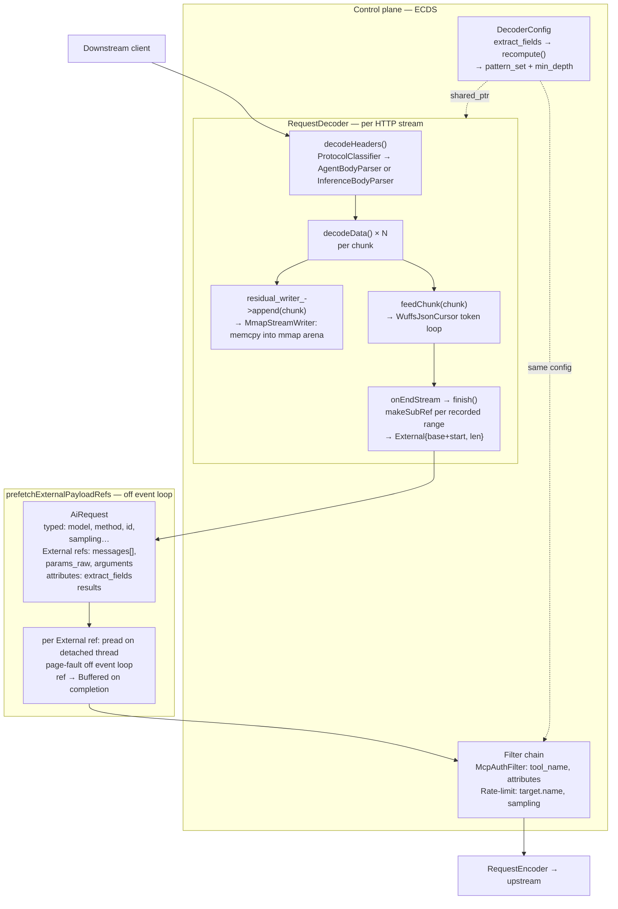

# AI Protocol Parsing

## 1. Design constraints

Five constraints together uniquely determine the architecture.

- **Streaming** — HTTP body arrives in arbitrary chunks on Envoy's single-threaded event loop. The parser must resume across chunk boundaries without blocking or buffering the full body.
- **Proportional heap** — The parser must not allocate heap proportional to any token it does not need — whether a 4 MB `content` value or a 4 MB key inside `params`.
- **Typed field extraction** — `model`, `stream`, `id`, `method`, and sampling params must emerge as native C++ types (`std::string`, `bool`, `int32_t`, `double`) immediately after `take()` — not as raw bytes requiring a second-pass parse.
- **Zero-copy sub-document capture** — `messages[]`, `tools[]`, `arguments`, and `params` must be captured as byte-range references into the original mmap'd body — not copied.
- **Duplicate key rejection** — Key-smuggling attacks (`{"model":"a","model":"b"}`) must be rejected mid-stream, before auth or upstream routing runs.

Constraints 1 and 2 together uniquely select Wuffs over all alternatives (see §12). Constraints 3–5 shape the `Handler` interface and `AiRequest` field layout.

---

## 2. Core design

A Wuffs streaming tokenizer fires per-token callbacks as each HTTP chunk arrives. Routing scalars (`model`, `method`, `id`) are extracted inline into small strings. Everything else — `messages[]` content, `arguments` blobs — is recorded as byte offsets (`body_src_pos_`) and later surfaced as zero-copy mmap sub-references (`PayloadRef::External`), with zero heap allocation during parse.

**Why Wuffs:** it is the only off-the-shelf library providing resumable streaming (stackless coroutine), per-token discard (no pre-allocation before callback), and raw byte positions simultaneously. See §12 for the library-by-library comparison.


**High-level flow:** `decodeHeaders` classifies the request and creates a parser. `decodeData` feeds each chunk to the Wuffs tokenizer (extracting routing fields inline, writing body bytes to mmap, recording element byte ranges) and returns immediately. `onEndStream` finalizes sub-refs via pointer arithmetic. `prefetchExternalPayloadRefs` reads the mmap bytes on a detached thread (page-fault off the event loop) before the filter sub-chain runs.

---

## 3. Request pipeline



---

## 4. Wuffs token model

Every `wuffs_json__decoder__decode_tokens()` call fills a 256-slot token ring. Four VBC classes matter:

| VBC constant | Meaning | Action |
|---|---|---|
| `FILLER` | Whitespace, commas, colons | Advance `body_src_pos_` by `tlen`; no output |
| `STRUCTURE` | `{` `}` `[` `]` | Manage `depth_`, record byte ranges on push/pop |
| `STRING` | String segment (key or value) | Gate on `str_target_`; call `appendStringToken` if non-null |
| `NUMBER` / `LITERAL` | Number, `true`/`false`/`null` | Type-convert inline; advance `expecting_key_` |

### `str_target_` null gate — the central memory safety mechanism

At the start of each STRING chain, the parser calls `handler_.selectStringTarget(depth)`. If it returns `nullptr`, `appendStringToken` is never called — **zero heap allocated for that token regardless of its size**.

```
InferenceBodyParser:
  depth 1, key == "model"    → &model_       (extract)
  depth 1, key == "stop"     → &string_val_  (extract)
  depth 2, in_stop_array_    → &string_val_  (extract)
  anything else (depth 3+)   → nullptr       ← 0 bytes heap, unconditionally

AgentBodyParser:
  depth 1, key == "id"       → &id_          (extract)
  depth 1, key == "method"   → &method_      (extract)
  depth 2, in_params_, known → &params_name_ / &params_uri_ / &params_ref_
  anything else (depth 3+)   → nullptr       ← 0 bytes heap, unconditionally
```

A 4 MB `content` value at depth 3 produces ~62 STRING tokens. All 62 are discarded before any allocation — the guarantee is structural, not flag-dependent.

Note: depth 3+ can still be parseed based on parser configuration. see: config-driven deep field extraction

### Multi-token strings

A logical string can span multiple tokens when it exceeds 65535 bytes or contains escape sequences. `in_chain_` is a member (not a local), so string accumulation survives `feed()` call boundaries when Wuffs returns `short_read` mid-string.

**Example — value longer than 65535 bytes:**

```json
{"model": "gpt-4o-this-is-a-very-long-model-name....<70000 chars total>...."}
```

Wuffs emits two tokens because `tlen` is 16-bit (max 65535):

```
Token 1:  STRING  cont=true   raw = first 65535 chars
Token 2:  STRING  cont=false  raw = remaining chars
```

Parser behavior:

```
Token 1 (cont=true):
  in_chain_=false → first token; selectStringTarget(1) → &model_
  appendStringToken(model_, raw)   → model_.append(65535 chars)
  in_chain_=true

Token 2 (cont=false):
  in_chain_=true → continuation; selectStringTarget() NOT called again
  str_target_ still == &model_
  appendStringToken(model_, raw)   → model_.append(remaining chars)
  in_chain_=false
  onStringComplete(&model_)        → model_ complete
```

**Cross-chunk boundary — chunk ends mid-string:**

```
feed(chunk_1):  contains first 40000 chars of the value
  Token 1: STRING cont=true → model_.append(40000 chars), in_chain_=true
  Wuffs returns short_read; feed() returns OK
  in_chain_=true persists on the parser object

feed(chunk_2):  contains remaining 30000 chars
  Token 2: STRING cont=false
  in_chain_=true → continuation recognized; str_target_ stays &model_
  model_.append(30000 chars); onStringComplete fires
```

If `in_chain_` were a local variable it would reset to `false` between `feed()` calls. The second chunk would call `selectStringTarget()` again, clear `model_`, and corrupt the accumulated value.

### Outer loop status handling

The `feed()` implementation has two nested loops because there are two independent resources that can be exhausted in either order: the **source buffer** (the current HTTP chunk) and the **token ring** (256-slot output buffer for tokens).
Source buffer (src_buf) — the current HTTP chunk. Can run out while tokens remain to be emitted.
Token ring (tok_buf_, 256 slots) — the output buffer for tokens. Can fill up while source bytes remain.

```
outer loop:
  while (true)
    status = decode_tokens(dec_, &tok_buf_, &src_buf)   // fills tok_buf_ from src_buf

    inner loop:    
      while (tok_buf_.meta.ri < tok_buf_.meta.wi)                                      
        tok = tok_buf_.data.ptr[tok_buf_.meta.ri++]  // drain whatever was produced
        dispatch on vbc …

    inspect status:
        nullptr / is_note  → wuffs_done_=true, break outer   (document complete)
        short_read         → break outer, return OK           (chunk exhausted)
        short_write        → reset tok_buf_ ri=wi=0, continue outer  (ring was full)
        error              → return InvalidArgumentError       (malformed JSON → 400)
```

**Why two loops are necessary.** Each `decode_tokens` call reads from `src_buf` and writes tokens into `tok_buf_` until one of them is exhausted:

| Source exhausted? | Ring full? | Status | Action |
|---|---|---|---|
| Yes | No | `short_read` | Chunk fully consumed — break outer, return OK, wait for next `feed()` |
| No | Yes | `short_write` | Ring filled before chunk ended — inner loop drains it, outer loop resets ring and calls `decode_tokens` again on the same `src_buf` |
| Yes (doc done) | No | `nullptr` / `is_note` | Document complete — break outer, set `wuffs_done_=true` |

A single call to `decode_tokens` can only fill the ring with at most 256 tokens. A long JSON array with hundreds of short keys generates far more than 256 tokens per chunk. Without the outer loop, those extra tokens would never be produced — `short_write` would be silently dropped and the chunk partially processed.

Without the inner loop, the ring would never be drained between outer iterations — `decode_tokens` would keep returning `short_write` forever because the ring stays full.

The two loops together enforce the invariant: **every source byte in the current chunk is fully tokenized before `feed()` returns**. The inner loop empties the ring; the outer loop keeps refilling it until the source is exhausted.

### `body_src_pos_` invariant

Advances by `tlen` for **every** token including FILLER and DROP tokens. Combined with `chunk_base` (value of `body_src_pos_` at chunk start), gives exact byte offsets for `makeSubRef`:
```cpp
const absl::string_view raw = chunk.substr(tok_start - chunk_base, tlen);
```

---

## 5. Three-tier memory model

| Body size | Tier | Behavior |
|---|---|---|
| ≤ `max_element_capture_bytes` (256 KB) | **Tier 1** | Full capture: depth-3 push inside `messages[]`/`tools[]`/`arguments` records `elem_start_`; depth-3 pop records `{start, end}`. `finish()` converts ranges to `PayloadRef::External` sub-refs. |
| > 256 KB, ≤ `max_body_bytes` (4 MB) | **Tier 2** | Scalars only: `model`, `method`, `id`, sampling params extracted. `messages[]`/`tools[]`/`arguments` ranges NOT recorded — those `PayloadRef`s are empty. Body still lands in mmap as a single `residual_params = External{0, body_size}`. |
| > `max_body_bytes` | **Tier 3** | Hard reject: `feed()` returns `ResourceExhausted` → 413 before any JSON parsing runs for that chunk. |

The only Tier 1 vs Tier 2 branch is a single `captureEnabled()` check:
```cpp
bool captureEnabled() const { return total_bytes_ <= config_.max_element_capture_bytes; }
```

---

## 6. Parsers

Both `InferenceBodyParser` and `AgentBodyParser` are private inner classes of `RequestDecoder`, implemented in `request_decoder.cc`. They share the `WuffsJsonCursor` loop skeleton — differences are only in what depths extract which fields.

### What each parser extracts

| Depth | InferenceBodyParser | AgentBodyParser |
|---|---|---|
| 1 | `model` → `std::string`, `stream` → `bool`, `max_tokens`/`n`/`seed` → int, `temperature`/`top_p` → double, `stop` scalar | `method` → `std::string`, `id` → `std::string` (numeric id normalized to string) |
| 2 | `messages[]` / `tools[]` element start/end (Tier 1), `stop[]` array elements | `params.name` → `std::string`, `params.uri` → `std::string`, `params.ref` → `std::string`, `params` byte range |
| 3+ | `str_target_=nullptr` — zero heap | `str_target_=nullptr` — zero heap; `arguments`/`capabilities` byte range recorded (Tier 1) |

### `AiRequest` output

```
InferencePayload:
  target.name     = model_        (std::string)
  sampling        = sampling_     (SamplingParams)
  streaming       = streaming_    (bool)
  messages[]      = External refs (Tier 1 only)
  tools[]         = External refs (Tier 1 only)
  residual_params = External{0, body_size}

AgentPayload:
  invocation      = classified from rpc_method
  dialect         = Mcp / A2a
  tool_name / resource_uri / prompt_name = params sub-fields
  params_raw      = External sub-ref of residual_params
  arguments       = External sub-ref (Tier 1 only)
  capabilities    = External sub-ref (Tier 1 only)
  residual_params = External{0, body_size}
```

### E2E trace — inference `POST /v1/chat/completions` (Tier 1)

```json
{"model":"gpt-4o","stream":true,"max_tokens":512,"messages":[{"role":"user","content":"Hi"}]}
```

```
Token              depth  str_target_    Effect
───────────────────────────────────────────────────────────────────────────────
PUSH {             0→1    —              is_dict_[1]=T
KEY  "model"       1      &str_acc_      current_key_="model"
VAL  "gpt-4o"      1      &model_        model_="gpt-4o"
KEY  "stream"      1      &str_acc_      current_key_="stream"
LIT  true          1      —              streaming_=true
KEY  "max_tokens"  1      &str_acc_      current_key_="max_tokens"
NUM  512           1      —              SimpleAtoi → sampling_.max_tokens=512
KEY  "messages"    1      &str_acc_      current_key_="messages"
PUSH [             1→2    —              in_messages_=true
PUSH {             2→3    —              in_elem_=true, elem_start_=offset('{')
KEY  "role"        3      &str_acc_      str_acc_="role"
VAL  "user"        3      nullptr ◀━━━  0 bytes heap
KEY  "content"     3      &str_acc_      str_acc_="content"
VAL  "Hi"          3      nullptr ◀━━━  0 bytes heap
POP }              3→2    —              message_ranges_ ← {elem_start_, pos}
POP ]              2→1    —              in_messages_=false
POP }              1→0    —              —
```

`finish()`: `residual_params = External{0, 90}`, `messages[0] = External{elem_start, len}` — pointer arithmetic only.

### E2E trace — agentic `POST /mcp` tools/call (Tier 1)

```json
{"jsonrpc":"2.0","id":"req-1","method":"tools/call","params":{"name":"read_file","arguments":{"path":"/etc/config.json"}}}
```

```
Token                  depth  str_target_      Effect
─────────────────────────────────────────────────────────────────────────────────────
PUSH {                 0→1    —                is_dict_[1]=T
KEY  "jsonrpc"         1      &str_acc_        current_key_="jsonrpc"; seen_jsonrpc_=T
VAL  "2.0"             1      nullptr ◀━━━━━  0 bytes heap (key≠"id",≠"method")
KEY  "id"              1      &str_acc_        current_key_="id"; seen_id_=T
VAL  "req-1"           1      &id_             id_="req-1"
KEY  "method"          1      &str_acc_        current_key_="method"; seen_method_=T
VAL  "tools/call"      1      &method_         method_="tools/call"
KEY  "params"          1      &str_acc_        current_key_="params"; seen_params_=T
PUSH {                 1→2    —                in_params_=T; params_byte_start_=offset('{')
KEY  "name"            2      &str_acc_        params_key_="name"
VAL  "read_file"       2      &params_name_    params_name_="read_file"
KEY  "arguments"       2      &str_acc_        params_key_="arguments"
PUSH {                 2→3    —                in_sub_container_=T; sub_is_arguments_=T
                                               sub_container_start_=offset('{')
                                               arguments_kind_=JsonObject
KEY  "path"            3      &str_acc_        str_acc_="path"
VAL  "/etc/config.json" 3     nullptr ◀━━━━━  0 bytes heap (depth 3+)
POP }  arguments       3→2    —                in_sub_container_=F; captureEnabled()=T →
                                               arguments_byte_start_=sub_container_start_
                                               arguments_byte_end_=body_src_pos_
POP }  params          2→1    —                in_params_=F; params_byte_end_=body_src_pos_
POP }  root            1→0    —                —
```

`finish()`:
```
request.jsonrpc_id = "req-1"
request.rpc_method = "tools/call"
classify(POST, /mcp, "tools/call") → invocation=ToolsCall, dialect=Mcp
payload.tool_name  = "read_file"

residual_params = External{0, 120}              ← full body, zero-copy
params_raw      = External{params_start, len}   ← pointer arithmetic
arguments       = External{arg_start, arg_len}  ← pointer arithmetic
```

All three `External` refs point into the same mmap region — no intermediate copy, no DOM parse.

---

## 7. Security invariants

1. **`body_src_pos_` is always exact** — advances by `tlen` for every token (including FILLER and DROP). All byte-range offsets passed to `makeSubRef` are true positions in the raw body stream.

2. **Sub-refs are always valid subsets of `residual_params`** — `makeSubRef` is a no-op when `end <= start` or the parent ref is empty. `residual_writer_->append` runs before `feedChunk`, so the full body (including both delimiters) is in `residual_params` when `finish()` runs.

3. **`wuffs_done_` prevents double-processing** — once set, all subsequent `feedChunk` calls return `OkStatus` immediately. The `finish()` call to `feedChunk("", true)` is safe to call even after an `OK` status.

4. **Duplicate-key detection is inline** — for both parsers, `seen_X_` flags are checked when a depth-1 key chain completes. On second occurrence, `InvalidArgumentError` is returned from `onKey` immediately. The 400 is sent before `finish()`, before auth, before upstream routing.

5. **`str_target_` null-safety** — `appendStringToken` is called only when `str_target_ != nullptr && tlen > 0`. `str_target_` is reset to `nullptr` at string completion. It cannot point at a freed string because all target strings are data members that outlive `feedChunk`.

6. **`in_chain_` survives `feed()` boundaries** — if a STRING chain spans an HTTP chunk boundary (`short_read` mid-chain), the next `feed()` resumes with `in_chain_=true`. `str_acc_` is not cleared and `str_target_` is not re-selected.

7. **Bounded attacker-controlled heap** — for any body up to `max_body_bytes` (4 MB): all depth-3+ values produce zero heap (structural guarantee). All keys at any depth accumulate into `str_acc_`, bounded by `max_body_bytes`. No single operation allocates more than 65535 bytes per Wuffs token (16-bit `tlen` ceiling).

---

## 8. Memory and heap analysis

### 7.1 Old vs new — the `token_buf_` vulnerability

| Property | Old `IncrementalJsonTokenizer` | New Wuffs-based |
|---|---|---|
| Depth-3+ value accumulation | `token_buf_` grows proportionally to value size | `str_target_=nullptr` — zero allocation regardless of value length |
| Key accumulation depth | All depths into `token_buf_` — unbounded | Keys into `str_acc_`, bounded by `max_body_bytes` |
| Token size bound | None — whole string per callback | 65535 bytes per Wuffs token (16-bit `tlen`) |
| Resumability | 14-state C++ machine, manually preserved | Wuffs stackless coroutine, automatic |
| Correctness guarantee | No formal proof | Wuffs toolchain verifies memory safety at compile time |

Attack example:
```json
{"model":"gpt-4o","messages":[{"role":"user","content":"<4 MB base64>"}]}
```

Old tokenizer: `token_buf_` grows to 4 MB for the `content` value even in non-capture mode.
New Wuffs parser: depth==3 → `str_target_=nullptr` → ~62 STRING tokens arrive, all discarded → **0 bytes heap**.

### 7.2 Per-request malloc budget (MmapPayloadStore, production)

**Fixed overhead — always paid:**

| Object | Allocs | Bytes |
|---|---|---|
| `InferenceBodyParser` / `AgentBodyParser` heap object (`make_unique`) | 1 | ~5.2 KB inline (see breakdown) |
| Wuffs decoder `dec_` (`wuffs_json__decoder::alloc()`) | 1 | ~2 KB |
| `residual_writer_` `StreamWriter` | 1 | ~64 B |
| `request_.path` (e.g. `/v1/chat/completions`, 22 chars > SSO) | 1 | ~24 B |
| `model_` / `method_` if > 15 chars SSO | 0–1 | 0–50 B |

**Parser object inline layout** (single heap alloc, not counting `dec_`):

| Member | Bytes |
|---|---|
| `WuffsJsonCursor::tok_data_[256]` (token ring buffer) | 4096 B |
| `key_stack_[8]` + `push_key_[9]` + `str_acc_` — 18 SSO strings @ 24 B | 432 B |
| `WuffsJsonCursor` depth/dict/index arrays | ~80 B |
| Parser string members (7 × 24 B SSO) | 168 B |
| `SamplingParams` optionals + `stop` vector shell | ~100 B |
| Range vector shells (4 × 24 B) | 96 B |
| Booleans and `size_t` fields | ~80 B |

**Body bytes — production vs test:**

| Store | Body bytes | Malloc? |
|---|---|---|
| `MmapPayloadStore` (production) | `memcpy` into mmap arena (OS page cache) | **No** — zero malloc for body content |
| `InMemoryPayloadStore` (test) | `Buffer::OwnedImpl` | **Yes** — proportional to body size |

**Per-element (Tier 1 only, ≤256 KB):** each `messages[i]` / `tools[i]` element adds ~60 B across three index vectors. Content bytes remain in mmap — not in these vectors.

**Per-matched extract_field:** `path_scratch_*` strings warm up on first call and are reused; `extracted_attrs_` value: 0 allocs if ≤15 chars (SSO), 1 otherwise. Both key and value are moved (not copied) into `request.attributes` at `finish()`.

### 7.3 Total budget summary

| Scenario | Heap allocs | Malloc bytes |
|---|---|---|
| Bodiless GET | ~2 | ~100 B |
| Tier 2 inference (body > 256 KB) | ~5 fixed | ~3.5 KB |
| Tier 1 inference, 10 messages | ~5 fixed + 3 amortized vector growths | ~4.2 KB |
| Tier 1 inference + 1 extract_field match | above + 0–2 string allocs | ~4.5 KB |

**Key invariant:** malloc budget is O(1) in body size. The only O(N) component is element count — ~60 B per element. A 4 MB body with 100 messages costs ~7 KB malloc; the same body with 1 message costs ~4 KB.

### 7.4 Peak heap by tier

| Component | Tier 1 (≤256 KB) | Tier 2 (≤4 MB) | Tier 3 (reject) |
|---|---|---|---|
| `dec_` Wuffs decoder | ~2 KB | ~2 KB | n/a |
| `tok_data_[256]` in-object | 4 KB | 4 KB | n/a |
| Routing field strings | O(field lengths) | O(field lengths) | n/a |
| Depth 3+ values | **0** (`str_target_=nullptr`) | **0** (`str_target_=nullptr`) | n/a |
| Peak malloc | **~6 KB + O(keys)** | **~6 KB + O(keys)** | **≤ one chunk** |
| Peak RSS (mmap) | body size (evictable) | body size (evictable) | 0 |

No meaningful heap difference between Tier 1 and Tier 2 — same code path runs; only `PayloadRef` population differs.

---

## 9. PayloadRef storage model

`PayloadRef` is a discriminated-union handle to a field value. All large fields in `InferencePayload` and `AgentPayload` are typed as `PayloadRef` to avoid copying large content.

| Variant | Data location | `toString()` | Typical origin |
|---|---|---|---|
| `Inline` | `std::string inline_data_` inside the ref | Direct return | Small fields ≤ `max_inline_bytes` (4 KB) |
| `Buffered` | `Buffer::OwnedImpl` on heap | `buffered_data_->toString()` | Heap fallback when mmap unavailable |
| `External` | `{uint64_t offset, size_t length}` into mmap region | **PANIC** — must go through `PayloadStore::fetch()` | `MmapPayloadStore` normal path |

Calling `toString()` on an `External` ref panics. Encoders must use `convertPayloadRefToString(ref, request)`, which routes through `request.payload_store->fetch()`.

### Sub-refs and `makeSubRef`

Both parsers create sub-refs of `residual_params` for nested fields. `makeSubRef` selects the right variant based on the parent:

```
parent External → makeExternal(parent.offset + field_start, field_len)  [zero-copy]
parent Inline   → store_.store(parent.substr(field_start, field_len))   [small copy]
parent Buffered → store_.store(extracted bytes)                          [heap copy]
```

`makeSubRef` is a no-op when `field_len == 0` or parent is empty.

---

## 10. MmapPayloadStore

### Key design

- **Backing file**: anonymous temp file via `mkstemp` + immediate `unlink`. No directory entry; OS reclaims all pages on fd close. `~MmapPayloadStore` calls `munmap` + `close`.
- **Bump-allocated arena**: flat byte array; each `append` advances `write_offset_`. No per-allocation metadata overhead.
- **Capacity growth**: doubles when full. Linux: `mremap(MREMAP_MAYMOVE)`. macOS: `munmap` + `mmap`.
- **Fallback**: if `mkstemp` fails (`fd_ = -1`), all stores fall back to `PayloadRef::Buffered`. Always functional; failure degrades storage class, not correctness.

### Async fetch pipeline

External refs cannot be materialized on the event loop without risk of read page faults. Three layers:

1. `PayloadStore::fetch(ref, cb)` — synchronous, single ref. Used in tests and for Inline/Buffered only.
2. `MmapPayloadStore::fetchAsync(ref, dispatcher, cb)` — spawns a detached thread that calls `pread(fd, buf, len, offset)` off the event loop, then posts `cb` back to the dispatcher. Thread captures `fd` by value — safe if store is destroyed before thread runs (`pread` returns -1, empty buffer posted).
3. `prefetchExternalPayloadRefs(request, dispatcher, on_done)` — fan-out over all External refs in the `AiRequest`. Creates `atomic<int> pending = refs.size()`; each callback decrements it; `on_done()` fires when it reaches zero. Called after `onEndStream`, before any filter sub-chain runs.

After `on_done()`, every `PayloadRef` in the request is `Inline` or `Buffered` — encoders can call `toString()` safely.

### Write vs read page faults

Write page faults (from `memcpy` into mmap during `decodeData`) are handled by the kernel's page allocator in microseconds and do not block the event loop. Read page faults (evicted pages faulted back) are expensive — those are what `fetchAsync` offloads to the `pread` thread.

---

## 11. extract_fields — config-driven deep field extraction

### Problem

Filters like `McpAuthFilter` need to inspect deeply-nested fields (e.g. `params.arguments.database`) for authorization decisions. The parser's `str_target_=nullptr` rule correctly discards these at depth 3+. `extract_fields` provides an operator-configured escape hatch that re-enables capture for specific paths.

### Configuration

Delivered via ECDS (Extension Config Discovery Service — xDS for per-filter dynamic updates without listener drain). Defined on `DecoderConfig`:

```cpp
struct DecoderConfig {
  std::vector<ExtractFieldSpec> extract_fields;       // json_path per field
  absl::flat_hash_set<std::string> extract_field_pattern_set;  // derived
  size_t min_extract_depth{SIZE_MAX};                 // derived

  void recompute();  // call after any mutation to extract_fields
};
```

`recompute()` builds `extract_field_pattern_set` and `min_extract_depth` once at config push time — O(N_patterns) work at config time, O(1) lookup per token at request time.

### Path notation

| Notation | Matches | Example |
|---|---|---|
| `params.arguments.database` | exact indexed path | `params.arguments.database` |
| `messages[].role` | per-element field in top-level array | `messages[0].role`, `messages[1].role` |

`buildPaths(depth)` outputs two strings:
- `indexed_path` — e.g. `messages[0].role` — used as the attribute key in `AiRequest::attributes`
- `pattern_path` — e.g. `messages[].role` — used for `pattern_set.contains()` lookup

### Implementation and heap optimizations

Six heap issues were identified and fixed in the implementation:

| Issue | Root cause | Fix |
|---|---|---|
| 1: unconditional `key_stack_` work | All keys copied at every depth even without extract_fields | `track_paths_` bool in `WuffsJsonCursor`; guarded by `!config_.extract_field_pattern_set.empty()` |
| 2: `buildPaths` local strings | `std::string indexed, pattern` declared locally — per-call alloc/free | Promoted to `path_scratch_indexed_` / `path_scratch_pattern_` members; reused after first call |
| 3: config field copy | Matched value copied twice (into scratch, then into storage) | `config_field_scratch_` as direct target; `std::swap` transfers ownership of indexed path |
| 4: no depth guard | `buildPaths` called at every depth even for shallow-only patterns | `min_extract_depth_` member; `buildPaths` skipped entirely for `depth < min_extract_depth_` |
| 5: pattern set rebuilt per request | `flat_hash_set` reconstructed on every request from `extract_fields` list | `extract_field_pattern_set` on `DecoderConfig`; built once in `recompute()` |
| 6: key copy at `finish()` | `absl::flat_hash_map` has `const` keys; moving into `request.attributes` required copying the key | `extracted_attrs_` changed from `flat_hash_map` to `vector<pair<string,string>>`; both key and value movable |

### Data flow

```
DecoderConfig::extract_fields (ECDS push)
  → recompute(): pattern_set + min_depth (config-time, O(N_patterns))
    → InferenceBodyParser / AgentBodyParser constructor:
        track_paths_ = !pattern_set.empty()
        min_extract_depth_ = config.min_extract_depth
      → per token (selectStringTarget / onScalar):
          if depth < min_extract_depth_: skip
          buildPaths(depth, indexed_scratch, pattern_scratch)   [no alloc after warmup]
          if pattern_set.contains(pattern_scratch):
            capture → extracted_attrs_.emplace_back(move(indexed), value)
        → finish():
            for k, v in extracted_attrs_:
              request.attributes.emplace(move k, move v)  [zero copies]
→ McpAuthFilter:
    ParamCondition{field=ATTRIBUTE, attribute_key="params.arguments.database"}
    evaluate(): request.attributes.find(key) → matcher.matches(value)
```

---

## 12. Parser library comparison

### Three requirements for library selection

| Req | What it demands | Why relaxing it is not an option |
|---|---|---|
| **1. Resumable streaming** | Parser must accept N partial chunks and resume across them without buffering the full body. | Envoy's event-loop model: `decodeData` must return immediately. Blocking to wait for more data is not possible. The alternative (buffer-then-parse-at-end) works but loses inline rejection. |
| **2. Pre-accumulation discard** | The discard decision must happen *before* the library allocates memory for a token, not after. | Post-accumulation discard (SAX `onString(ptr, len)` callbacks) allocates before the handler runs. A 4 MB `content` value inside `messages[0]` has already consumed 4 MB by the time your code decides to ignore it. You cannot un-allocate. |
| **3. Raw byte positions** | Exact source byte offsets for `makeSubRef` → `PayloadRef::External{offset, len}` | Required for zero-copy dispatch without string accumulation. Without it, sub-field extraction forces O(element_size) alloc — contradicts requirement 2. (Has no additional discriminating power: by the time req 1+2 are applied, only Wuffs remains.) |

### Pre-accumulation discard: what SAX libraries do vs what Wuffs does

**SAX libraries (RapidJSON, YAJL, old `IncrementalJsonTokenizer`):**
```
chunk arrives: {"content": "<4 MB base64>"}
                             ^ tokenizer starts here
                               allocates internal buffer, fills as bytes arrive
                               ...4 MB later...
                               calls onString(ctx, ptr, 4MB_len)
                                                          ^ your code runs HERE
                                                            too late — 4 MB already on heap
```

**Wuffs:**
```
chunk arrives: {"content": "<65535-byte segment>..."}
                             ^ Wuffs emits STRING token: (raw_ptr, tlen=65535, vbd)
                               str_target_ = nullptr?
                               → appendStringToken never called → 0 bytes allocated
                             next token: another 65535-byte segment
                               → still nullptr → 0 bytes allocated
                             ...62 tokens for the 4 MB value...
                             total heap: 0
```

The guarantee is structural: there is no internal buffer to undo.

### Library matrix

| Library | Req 1: Resumable streaming | Req 2: Pre-accumulation discard | Req 3: Raw byte positions |
|---|---|---|---|
| nlohmann/json | ✗ requires complete document | ✗ full DOM allocation | ✗ no positions |
| RapidJSON SAX | ✗ no chunk resumption | ✗ full string before callback | ✗ no positions |
| simdjson DOM | ✗ requires complete document | ✗ full tape allocation | ✓ computed |
| simdjson ondemand | ✗ requires complete document | ✓ lazy, no tape | ✓ sv offset |
| YAJL | ✓ genuinely streaming | ✗ full string before callback | ✗ no positions |
| jsmn | ✗ requires complete document | ✓ token offsets only | ✓ native |
| Custom tokenizer (predecessor) | ✓ streaming | ✗ accumulates all keys in `token_buf_` | ✗ no positions |
| **Wuffs** | **✓** | **✓** | **✓** |

Requirements 1 and 2 together uniquely select Wuffs.

### Wuffs vs simdjson-ondemand + mmap-at-`onEndStream` (most plausible alternative)

simdjson ondemand is the closest alternative — it has lazy value access and could theoretically be combined with mmap-backed storage.

| | Wuffs streaming | simdjson ondemand + mmap at `onEndStream` |
|---|---|---|
| Body in mmap | Yes | Yes — identical |
| Parse-time heap | ~6 KB, O(1) | O(document/64) — stage 1 structural scan builds positional index (~500 KB for 4 MB body) |
| SIMD padding requirement | None | 64-byte over-alloc in `MmapPayloadStore` or O(body_size) copy |
| Page fault pattern | Zero — reads hot network chunks just DMA'd | Full-document SIMD scan touches all pages at once |
| Event loop blocking | ~16µs/chunk, amortized | ~1.3ms for 4 MB body (one blocking call) |
| Inline rejection | Mid-stream | Only at end of document |

### Wuffs costs

| Cost | Impact |
|---|---|
| Manual escape decoding | `appendStringToken` written by hand; `\uXXXX` surrogate pairs not stitched (documented limitation) |
| Continued-token handling | Multi-token strings require `in_chain_` state across `feed()` boundaries — extra state no SAX library requires |
| VBC/VBD bitfield reading | Lower-level than SAX callbacks; `switch(vbc)` harder to read than `onString(...)` |
| Single-author project | Wuffs is a research project. RapidJSON and simdjson have far more users and issue history. |
| Build: `WUFFS_IMPLEMENTATION` | Must be defined in exactly one translation unit (`wuffs_impl.c`). Non-obvious to newcomers. |

---

## 13. Configuration

`DecoderConfig` (in `request_decoder.h`):

| Field | Default | Role |
|---|---|---|
| `max_inline_bytes` | 4 KB | Fields ≤ this size stored as `PayloadRef::Inline`. Larger fields become `Buffered` or `External`. |
| `max_body_bytes` | 4 MB | Hard limit. `feed()` returns `ResourceExhausted` as soon as accumulated bytes exceed this. Attacker-controlled heap bounded here. |
| `max_element_capture_bytes` | 256 KB | Tier 1 vs Tier 2 boundary. Bodies above this skip per-element byte-range recording but still extract all scalar routing fields. |
| `extract_fields` | `[]` | JSON paths to pre-extract into `AiRequest::attributes`. Call `recompute()` after mutation. |
| `extract_field_pattern_set` | derived | O(1) pattern lookup set. Built by `recompute()`. |
| `min_extract_depth` | derived | Shallowest configured path depth. `buildPaths` skipped entirely for shallower tokens. |

Both parsers hold a `const DecoderConfig&` reference — not a copy. Config is owned by the outer filter and outlives the decoder.
