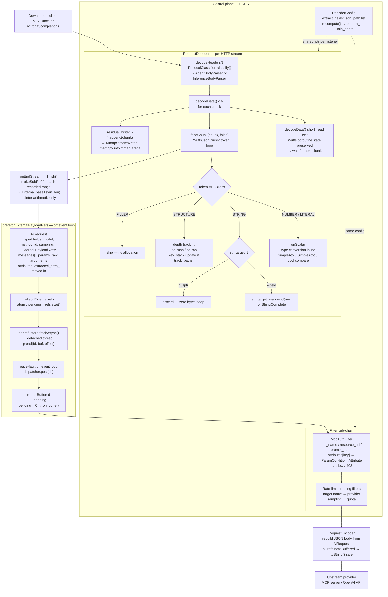
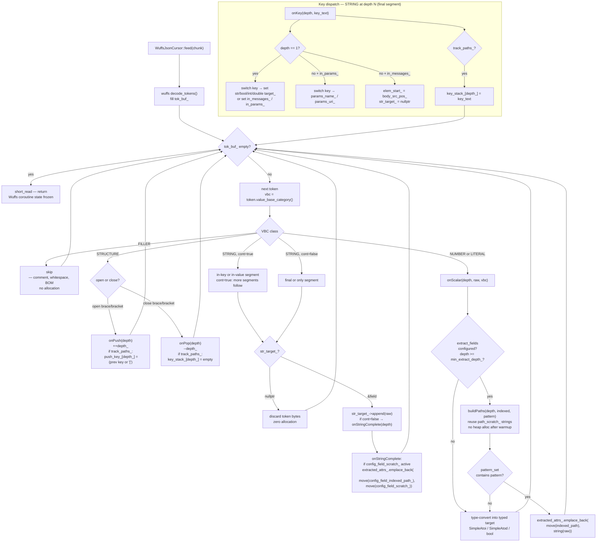
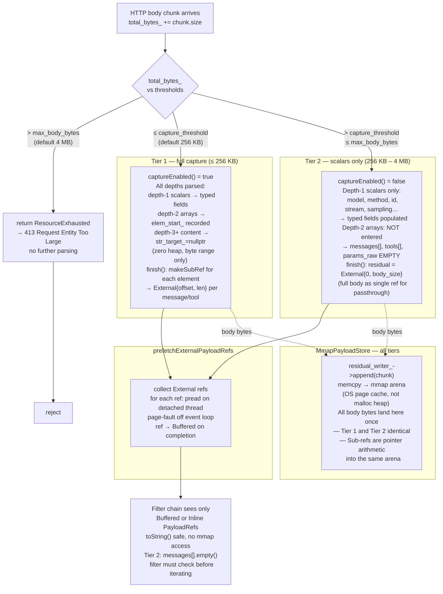

# AI Protocol Parsing

## Quick reference

**Problem:** The proxy parses JSON request bodies (OpenAI inference REST and JSON-RPC MCP/A2A)
under five constraints:

1. **Streaming:** The HTTP body arrives in arbitrary chunks on Envoy's single-threaded event loop
   — the parser must resume across chunk boundaries without blocking or buffering the full body.
2. **Proportional heap:** The parser must not allocate the heap in proportion to
   any token it does not need — whether a 4 MB string value (`content`) or a 4 MB
   key name buried inside `params`. The mmap store absorbs the body bytes; the C++ allocator
   must not.
3. **Typed routing field extraction:** The filter uses `model`, `stream`, `rpc_method`, `id`, and
   sampling params as native C++ types (`std::string`, `bool`, `int32_t`, `double`) immediately
   after `take()` — not as raw JSON byte sequences that the caller would still need to parse.
4. **Zero-copy sub-document capture:** Individual JSON sub-trees (`messages[]`, `tools[]`,
   `arguments`, `params`) must be captured as byte-range references into the original mmap'd body
   — forwarded to upstream or inspected by chain filters as opaque without copying.
5. **Duplicate key rejection:** Key-smuggling attacks (two `"model"` fields, two `"method"`
   fields) must be detected and rejected mid-stream before reaching auth or upstream — not after
   buffering the full body.

Constraints 1 and 2 together uniquely select Wuffs over all other off-the-shelf libraries (see
§16). Constraints 3–5 shape the Handler interface and `AiRequest` field layout.

**Core design:** A Wuffs streaming tokenizer fires per-token callbacks as each HTTP chunk arrives.
Routing scalars (`model`, `method`, `id`) are extracted inline into small strings. Everything else
— `messages[]` content, `arguments` blobs — is recorded as byte offsets (`body_src_pos_`) and
later surfaced as zero-copy mmap sub-references (`PayloadRef::External`), with zero heap
allocation during parse.

**Why Wuffs:** it is the only off-the-shelf library providing resumable streaming (stackless
coroutine), per-token discard (no pre-allocation before callback), and raw byte positions
simultaneously. See §16 for the library-by-library comparison.

**Issues solved over the predecessor:** The old `IncrementalJsonTokenizer` (bespoke 14-state
machine) accumulated every JSON key at every nesting depth into a single `token_buf_`, allowing
an attacker to force O(body_size) heap growth by embedding a long key inside `params`. Wuffs
eliminates this: each token has a 16-bit length ceiling (max 65535 bytes), there is no
accumulation buffer in the library, and the application's `str_target_=nullptr` mechanism
discards tokens before any allocation occurs.

**High-level flow:** `decodeHeaders` classifies the request and creates a parser.
`decodeData` feeds each chunk to the Wuffs tokenizer (extracting routing fields inline, writing
body bytes to mmap, recording element byte ranges) and returns immediately. `onEndStream`
finalizes sub-refs via pointer arithmetic. `prefetchExternalPayloadRefs` reads the mmap bytes
on a detached thread (page-fault off the event loop) before the filter sub-chain runs.

---

## 0. Constraint deep-dives

### 0.1 Typed routing field extraction

**What "typed" means.** After `RequestDecoder::take()` returns an `AiRequest`, the
caller receives routing fields as native C++ types — not as raw JSON byte sequences.
The conversion (JSON token bytes → C++ value) happens inside `onScalar` during
streaming, one token at a time, so no second-pass parsing is ever needed.
Semantic interpretation — byte sequence → C++ value 

**Typed fields and their C++ types:**

| Protocol  | JSON key       | C++ field                          | C++ type        |
|-----------|----------------|------------------------------------|-----------------|
| Inference | `"model"`      | `InferencePayload::target.name`    | `std::string`   |
| Inference | `"stream"`     | `AiRequest::streaming`             | `bool`          |
| Inference | `"max_tokens"` | `SamplingParams::max_tokens`       | `absl::optional<int32_t>` |
| Inference | `"temperature"`| `SamplingParams::temperature`      | `absl::optional<double>`  |
| Inference | `"top_p"`      | `SamplingParams::top_p`            | `absl::optional<double>`  |
| Inference | `"seed"`       | `SamplingParams::seed`             | `absl::optional<int64_t>` |
| Agent     | `"method"`     | `AiRequest::rpc_method`            | `std::string`   |
| Agent     | `"id"`         | `AiRequest::jsonrpc_id`            | `std::string`   |
| Agent     | `params.name`  | `AgentPayload::tool_name`          | `std::string`   |
| Agent     | `params.uri`   | `AgentPayload::resource_uri`       | `std::string`   |

**What the tests verify.** From `request_decoder_test.cc`:

```cpp
// InferenceDecoderTest::SmallBody_ElementsCaptured (line 105)
EXPECT_EQ("gpt-4o", payload->target.name);   // std::string, not absl::string_view
EXPECT_TRUE(result->streaming);               // bool, not string "true"
EXPECT_EQ(512, payload->sampling.max_tokens); // int32_t, not string "512"

// AgentDecoderTest::SmallBody_ParamsCaptured (line 235)
EXPECT_EQ("tools/call", result->rpc_method);  // std::string
EXPECT_EQ("search", payload->tool_name);      // std::string

// LargeBody_ScalarsOnlyNoElements (line 129) — Tier 2: elements NOT captured,
// but scalars still extracted with full type conversion.
EXPECT_EQ("gpt-4o", payload->target.name);
EXPECT_TRUE(result->streaming);
EXPECT_TRUE(payload->messages.empty());       // elements skipped
```

The Tier 2 test is the critical one: even when `messages[]`/`params` element capture
is skipped to avoid O(element_size) heap, the typed scalars are still populated. This
is only possible because type conversion happens at token boundaries — not at
end-of-document. A DOM-style or even pure SAX library that required full document
accumulation before dispatching values would not support this.

**Where conversion happens in the code.** In `InferenceBodyParser::onScalar` and
`AgentBodyParser::onScalar`, the Wuffs `vbc` token class determines the conversion:

```cpp
case WUFFS_BASE__TOKEN__VBC__LITERAL:
  // "true"/"false"/"null" — compared as raw bytes, no heap
  if (bool_target_) *bool_target_ = (raw == "true");   // stream → bool

case WUFFS_BASE__TOKEN__VBC__NUMBER:
  // integer or float token bytes — converted in-place
  if (int_target_)    absl::SimpleAtoi(raw, int_target_);   // max_tokens → int32_t
  if (double_target_) absl::SimpleAtod(raw, double_target_); // temperature → double

case WUFFS_BASE__TOKEN__VBC__STRING:
  // one or more segments; final segment has cont=false
  if (str_target_) str_target_->append(raw);           // model/method → std::string
```

**Why this is a distinct constraint from problem 2** (proportional heap). Problem 2
says "do not allocate proportional to content you don't need." Problem 3 says
"positively produce typed output for content you do need." A streaming parser that
discarded everything except byte ranges would satisfy problem 2 but leave typed
fields unpopulated — the filter chain would receive an `AiRequest` with an empty
`model` and unknown `streaming` flag, making routing and policy decisions impossible.

---

## 1. Motivation

AI inference and agentic request bodies impose unusual memory requirements on a
proxy. A single `POST /v1/chat/completions` may carry dozens of conversation
turns, each potentially containing base64-encoded images or large tool schemas,
pushing the JSON body into the hundreds of kilobytes. A JSON-RPC `tools/call`
body may carry a large `arguments` object whose values are never needed for
routing. Under concurrent load these bodies must be parsed with strict, predictable
heap cost.

### The `token_buf_` vulnerability in `IncrementalJsonTokenizer`

The original `AgentBodyParser` used `IncrementalJsonTokenizer` — a bespoke
14-state machine — to parse JSON-RPC request bodies. The tokenizer maintained a
single `std::string token_buf_` that accumulated every JSON key it encountered at
every nesting depth. In Tier 2 semantic mode (body too large for `params` capture),
the tokenizer still had to walk the entire body to extract routing fields, and
`token_buf_` grew with every key regardless of its depth.

An attacker-crafted body like:

```json
{
  "method": "tools/call",
  "params": {
    "AAAAAAAAAAAAA...4 MB of A's...AAAAAAAA": "value"
  }
}
```

caused `token_buf_` to grow proportionally to the key inside `params`. The Tier 2
O(1) heap guarantee was defeated — the attacker controlled heap allocation by
choosing a long key name inside a nested object. The tokenizer accumulated keys at
every depth without distinction between depth-1 keys (which must be accumulated for
routing) and depth-2+ keys (which are irrelevant and should be discarded in Tier 2).

`InferenceBodyParser` had the same vulnerability. It too was backed by
`IncrementalJsonTokenizer`, which accumulated every JSON key and number literal
into `token_buf_`, including keys inside `messages[]` elements at depth 3 and
beyond, before firing any callback. An attacker embedding a long key name anywhere
inside a `messages[]` element would cause `token_buf_` to grow proportionally — even
in Tier 2 where element content provides no routing signal and should be discarded
at zero heap cost. Wuffs eliminates this for both parsers.

### Why Wuffs

Wuffs (Wrangling Unsafe File Formats Safely) is a memory-safe, formally-verified
parser toolkit. Its JSON decoder is a stackless coroutine: all parse state lives in
a fixed-size heap struct (`wuffs_json__decoder`, approximately 2 KB), not on the
C++ call stack. This is exactly the property needed for streaming HTTP body parsing:

- **No `token_buf_` equivalent**: Wuffs does not accumulate a string for a token
  before emitting it. Each token arrives with a length field (`tlen`, 16-bit,
  max 65535 bytes) and a raw pointer into the source buffer. The application reads
  the bytes it needs in place and discards the token.
- **Bounded-per-token memory**: regardless of key or value length, the application
  sees one token of at most 65535 bytes at a time. A 4 MB key produces approximately
  62 tokens; each is processed in O(1) and discarded.
- **Stackless coroutine**: the same `dec_` pointer resumes exactly where it stopped
  across `feed()` calls. No C++ call-stack state needs to be preserved between HTTP
  chunks.
- **Formally verified**: the Wuffs toolchain proves memory safety at compile time.
- **No nlohmann**: routing fields are extracted inline during the streaming Wuffs
  scan. There is no second-pass DOM parse at `finish()` time.

## 2. End-to-end pipeline overview

```
╔══════════════════════════════════════════════════════════════════════════════════════════════════╗
║                          Envoy AI Protocol Manager — Request Pipeline                           ║
╚══════════════════════════════════════════════════════════════════════════════════════════════════╝

  Downstream client                                                        Upstream provider
       │                                                                          │
       │  POST /mcp                              POST /v1/chat/completions        │
       │  Content-Type: application/json         Content-Type: application/json   │
       ▼                                                   ▼
┌─────────────────────────────────────────────────────────────────────────────────────────────────┐
│  decodeHeaders()                                                                                │
│                                                                                                 │
│   RequestDecoder::onHeaders()                                                                   │
│     ProtocolClassifier::classify(method, path, headers)                                         │
│              │                                       │                                          │
│         AgenticMcp                              Inference                                       │
│              │                                       │                                          │
│     agent_parser_ = new                   inference_parser_ = new                              │
│       AgentBodyParser(config, store)         InferenceBodyParser(config, store)                 │
│              │                                       │                                          │
│         state = ParsingAgentBody              state = ParsingInferenceBody                      │
└─────────────────────────────────────────────────────────────────────────────────────────────────┘
       │                                                   │
       │  data chunk(s)                        data chunk(s)
       ▼                                                   ▼
┌───────────────────────────────┐           ┌─────────────────────────────────┐
│  decodeData() × N             │           │  decodeData() × N               │
│                               │           │                                 │
│  AgentBodyParser::feed(chunk) │           │  InferenceBodyParser::feed(chunk)│
│    total_bytes_ += chunk.size │           │    total_bytes_ += chunk.size   │
│    if > max_body_bytes → 413  │           │    if > max_body_bytes → 413    │
│                               │           │                                 │
│    residual_writer_           │           │    residual_writer_             │
│    ->append(chunk)            │           │    ->append(chunk)              │
│    ┌────────────────────┐     │           │    ┌────────────────────┐       │
│    │ MmapStreamWriter   │     │           │    │ MmapStreamWriter   │       │
│    │ memcpy → mmap arena│     │           │    │ memcpy → mmap arena│       │
│    └────────────────────┘     │           │    └────────────────────┘       │
│                               │           │                                 │
│    feedChunk(chunk, false)    │           │    feedChunk(chunk, false)      │
│    ┌────────────────────────┐ │           │    ┌──────────────────────────┐ │
│    │ Wuffs token loop       │ │           │    │ Wuffs token loop         │ │
│    │                        │ │           │    │                          │ │
│    │ depth 1:               │ │           │    │ depth 1:                 │ │
│    │  "method" → method_    │ │           │    │  "model"  → model_       │ │
│    │  "id"     → id_        │ │           │    │  "stream" → streaming_   │ │
│    │                        │ │           │    │  numbers  → sampling_    │ │
│    │ depth 2 (in_params_):  │ │           │    │  "stop"   → sampling_    │ │
│    │  "name" → params_name_ │ │           │    │                          │ │
│    │  "uri"  → params_uri_  │ │           │    │ depth 2:                 │ │
│    │                        │ │           │    │  "messages"→in_messages_ │ │
│    │ depth 3 (arguments/    │ │           │    │  "tools"  → in_tools_    │ │
│    │  capabilities):        │ │           │    │                          │ │
│    │  range start recorded  │ │           │    │ depth 3 (in_messages_ or │ │
│    │  str_target_=nullptr   │ │           │    │  in_tools_):             │ │
│    │  → 0 bytes heap        │ │           │    │  elem_start_ recorded    │ │
│    │                        │ │           │    │  str_target_=nullptr     │ │
│    │ dup key? → 400 inline  │ │           │    │  → 0 bytes heap          │ │
│    └────────────────────────┘ │           │    │                          │ │
│                               │           │    │ dup key? → 400 inline    │ │
│    short_read → wait for next │           │    └──────────────────────────┘ │
│    chunk (Wuffs coroutine     │           │                                 │
│    preserves all parse state) │           │    short_read → wait for next   │
└───────────────────────────────┘           │    chunk                        │
                                            └─────────────────────────────────┘
       │  end_stream                                    │  end_stream
       ▼                                               ▼
┌───────────────────────────────┐           ┌─────────────────────────────────┐
│  AgentBodyParser::finish()    │           │  InferenceBodyParser::finish()  │
│                               │           │                                 │
│  feedChunk("", closed=true)   │           │  feedChunk("", closed=true)     │
│  (flushes trailing number     │           │  (flushes trailing number token)│
│   token; no-op if done)       │           │                                 │
│                               │           │  residual_writer_->finalize()   │
│  residual_writer_->finalize() │           │  → PayloadRef::External         │
│  → PayloadRef::External       │           │    {offset=0, len=body_size}    │
│    {offset=0, len=body_size}  │           │  (full body, zero-copy)         │
│  (full body, zero-copy)       │           │                                 │
│                               │           │  for each message_ranges_[i]:   │
│  makeSubRef(params_raw,       │           │    makeSubRef(messages[i])      │
│    params_start, params_len)  │           │    → External{base+start, len}  │
│  → External{base+start, len}  │           │    (pointer arithmetic only)    │
│  (pointer arithmetic only)    │           │                                 │
│                               │           │  for each tool_ranges_[i]:      │
│  if captureEnabled():         │           │    makeSubRef(tools[i])         │
│    makeSubRef(arguments,      │           │    → External{base+start, len}  │
│      arg_start, arg_len)      │           │                                 │
│    → External{base+start,len} │           │  AiRequest {                    │
│    makeSubRef(capabilities,…) │           │    InferencePayload {           │
│                               │           │      target.name = model_       │
│  AiRequest {                  │           │      sampling    = sampling_    │
│    rpc_method = method_       │           │      streaming   = streaming_   │
│    jsonrpc_id = id_           │           │      messages[]  = [External…]  │
│    AgentPayload {             │           │      tools[]     = [External…]  │
│      tool_name   = name_      │           │      residual    = External      │
│      arguments   = External   │           │    }                            │
│      params_raw  = External   │           │  }                              │
│      residual    = External   │           │                                 │
│    }                          │           │  state = BodyComplete           │
│  }                            │           └─────────────────────────────────┘
│  state = BodyComplete         │
└───────────────────────────────┘
       │                                               │
       └────────────────────┬──────────────────────────┘
                            │
                            ▼
           ┌─────────────────────────────────────────┐
           │  prefetchExternalPayloadRefs()           │
           │                                          │
           │  collect all External PayloadRefs        │
           │  atomic<int> pending = refs.size()       │
           │                                          │
           │  for each External ref:                  │
           │    store.fetchAsync(ref, dispatcher, cb) │
           │    ┌───────────────────────────────────┐ │
           │    │ detached thread                   │ │
           │    │   pread(fd, buf, len, offset)     │ │
           │    │   ← may page-fault off event loop │ │
           │    │   dispatcher.post(cb(buf))        │ │
           │    └───────────────────────────────────┘ │
           │                                          │
           │  cb(): ref ← Buffered; --pending         │
           │  pending==0 → on_done()                  │
           │  (all refs now Inline or Buffered;        │
           │   toString() safe, no mmap access)        │
           └─────────────────────────────────────────┘
                            │
                            ▼
       ┌───────────────────────────────────────────────────┐
       │  Filter sub-chain (auth, rate-limit, routing…)    │
       │                                                   │
       │  MCP path:              Inference path:           │
       │  read AgentPayload      read InferencePayload     │
       │  tool_name → policy     target.name → provider   │
       │  params_raw → audit log sampling → rate limit     │
       │  arguments → transform  messages → content check  │
       └───────────────────────────────────────────────────┘
                            │
                            ▼
       ┌───────────────────────────────────────────────────┐
       │  RequestEncoder                                   │
       │                                                   │
       │  MCP path:              Inference path:           │
       │  AgentRequestEncoder    InferenceRequestEncoder   │
       │                                                   │
       │  rebuild JSON-RPC       rebuild REST JSON         │
       │  envelope from          body from                 │
       │  AiRequest fields:      AiRequest fields:         │
       │    id, method,            model, stream,          │
       │    params_raw             sampling, messages,     │
       │    (Buffered → str)       tools                   │
       │                          (Buffered → str)         │
       │  set upstream headers   set upstream headers      │
       │  Authorization: Bearer… Authorization: Bearer…    │
       └───────────────────────────────────────────────────┘
                            │
                            ▼
                     upstream provider
                  (MCP server / OpenAI API)
```

**Key properties visible in the diagram:**

| Property | Where it appears |
|---|---|
| Wuffs stackless coroutine | `feedChunk` preserves parse state across `decodeData` calls; `short_read` exits cleanly |
| Zero heap for depth-3+ content | `str_target_=nullptr` in both token loops regardless of value size |
| All body bytes land in mmap once | `decodeData` feeds each `Buffer::RawSlice` directly to `onData` — no intermediate `toString()` allocation; `residual_writer_->append(chunk)` is the only copy, from the network buffer into the mmap arena |
| Sub-refs are pointer arithmetic | `makeSubRef` → `External{base+start, len}`, no data copied |
| Async page-fault isolation | `pread` thread; event loop never blocks on read page-fault |
| Encoders see only Buffered/Inline | `prefetchExternalPayloadRefs` completes before filter sub-chain runs |
| Duplicate-key rejection is inline | `onKey` returns `InvalidArgumentError` mid-stream; `WuffsJsonCursor::feed` propagates it immediately; 400 returned before `finish()` |

---

## 3. Wuffs token model

Every call to `wuffs_json__decoder__decode_tokens()` fills `tok_buf_` with as
many tokens as fit in the 256-slot ring, then returns a status. Tokens are consumed
in the inner loop before the next decode call. Four token classes matter for both
parsers:

| VBC constant | Meaning | Action |
|---|---|---|
| `FILLER` | Whitespace, commas, colons | Advance `body_src_pos_` by `tlen`; no other action |
| `STRUCTURE` | Object/array open or close | Manage `depth_`, `is_dict_[]`, `expecting_key_[]`; record byte ranges |
| `STRING` | String content, quotes, or escapes | Gate on `str_target_`; call `appendStringToken` when non-null |
| `NUMBER` or `LITERAL` | Numeric or `true`/`false`/`null` | Extract scalars if applicable; advance `expecting_key_` |

### The `continued` flag and multi-token strings

A single JSON string may span multiple Wuffs tokens when it is longer than 65535
bytes or contains escape sequences that force a token boundary. The `continued`
flag (`cont`) is `true` on all tokens except the last of a chain. Both parsers
track chain state with `in_chain_`:

- **First token** (`!in_chain_`): clear `str_acc_`, determine `string_is_key_`,
  set `str_target_`.
- **Continuation tokens**: append to `*str_target_` (if non-null) via
  `appendStringToken`.
- **Final token** (`!cont`): commit the completed string; reset `str_target_ = nullptr`.

`in_chain_` is a data member, not a local variable, so in-progress string state
survives across `feed()` call boundaries when Wuffs returns `short_read` mid-chain.

### STRING DROP vs COPY tokens

String tokens carry VBD flags that distinguish three sub-types:

| VBD flag | Meaning | `appendStringToken` action |
|---|---|---|
| `CONVERT_0_DST_1_SRC_DROP` | Opening/closing quote or escape introducer | Early return — advance `body_src_pos_` but produce zero output bytes |
| `CONVERT_1_DST_1_SRC_COPY` | Plain ASCII or UTF-8 bytes | `out.append(raw)` directly |
| Neither flag | JSON escape sequence (`\n`, `\uXXXX`, etc.) | Decode inline; append decoded character(s) |

The DROP check is the first thing `appendStringToken` does:

```cpp
if (vbd & WUFFS_BASE__TOKEN__VBD__STRING__CONVERT_0_DST_1_SRC_DROP) return;
```

Failing to check it would append literal `"` and `\` characters into accumulated
routing fields and corrupt all subsequent comparisons.

### Short-read vs short-write

After draining the inner token loop, `feedChunk` inspects the status from
`decode_tokens`:

```
status == nullptr           → parse complete (OK); wuffs_done_ = true, break outer
is_note(&status)            → end_of_data on non-closed stream; wuffs_done_ = true, break
status == short_read        → need more input; break outer, return OK (wait for next feed)
status == short_write       → tok_buf_ full mid-stream; reset ri/wi to 0, continue outer
status is error             → invalid JSON; return InvalidArgumentError
```

`short_write` is the case where Wuffs produced 256 tokens before exhausting the
source. The outer loop resets `tok_buf_.meta.ri = tok_buf_.meta.wi = 0` and calls
`decode_tokens` again without advancing `src_buf` — Wuffs resumes from where it
left off in the source because source state is managed inside the coroutine.

---

## 4. Shared infrastructure

### `appendStringToken` free function

`appendStringToken` is defined as a free function in an anonymous namespace at the
top of `request_decoder.cc`, before either parser class, and is shared by both
`InferenceBodyParser` and `AgentBodyParser`:

```cpp
namespace {
void appendStringToken(std::string& out, absl::string_view raw, uint64_t vbd) {
  if (vbd & WUFFS_BASE__TOKEN__VBD__STRING__CONVERT_0_DST_1_SRC_DROP) return;
  if (vbd & WUFFS_BASE__TOKEN__VBD__STRING__CONVERT_1_DST_1_SRC_COPY) {
    out.append(raw.data(), raw.size());
    return;
  }
  // ... inline escape decoding for \n, \t, \uXXXX, etc.
}
} // namespace
```

Both parsers call this function from the same site within their STRING token
handlers, passing `*str_target_` (when non-null). The function handles all three
string sub-types (DROP, COPY, escape sequences) so neither parser needs escape
decoding logic of its own.

### Universal `feedChunk` loop skeleton

The outer loop structure is identical in both parsers:

```
feedChunk(chunk, closed):
  if !dec_: return InternalError
  if wuffs_done_: return OK          ← early exit, prevents re-entry

  chunk_base = body_src_pos_         ← absolute body offset of chunk[0]
  src_buf = wuffs_base__ptr_u8__reader(chunk, closed)

  outer loop:
    status = decode_tokens(dec_, &tok_buf_, &src_buf, empty_slice)

    inner loop — drain tok_buf_:
      tok  = tok_buf_.data.ptr[tok_buf_.meta.ri++]
      vbc  = token_value_base_category(tok)
      vbd  = token_value_base_detail(tok)
      tlen = token_length(tok)
      cont = token_continued(tok)

      tok_start      = body_src_pos_
      body_src_pos_ += tlen           ← advance for EVERY token

      switch vbc: ...parser-specific handling...

      if has_error_: break inner loop

    if has_error_: return InvalidArgumentError

    inspect status:
      nullptr     → wuffs_done_=true, break outer
      is_note     → wuffs_done_=true, break outer
      short_read  → break outer (return OK — wait for next feed())
      short_write → tok_buf_.meta.ri=wi=0, continue outer
      error       → return InvalidArgumentError

  return OkStatus
```

The only differences between the two parsers are in the `switch vbc` body.

### `body_src_pos_` invariant

`body_src_pos_` advances by `tlen` for **every** token Wuffs produces — including
FILLER (whitespace, colons, commas) and STRING DROP tokens (opening and closing
quotes). It is always synchronized with the raw source byte position at the start
of each token. Combined with `chunk_base` (the value of `body_src_pos_` at the
beginning of each `feedChunk` call), this makes raw byte extraction exact:

```cpp
const size_t tok_start = body_src_pos_;
body_src_pos_ += tlen;
absl::string_view raw = chunk.substr(tok_start - chunk_base, tlen);
```

The byte positions recorded for element ranges, `params_byte_start_/end_`,
`arguments_byte_start_/end_`, etc. are always true offsets into the raw body
stream that `residual_writer_` has captured. `makeSubRef` can safely index into
`residual_params` using these offsets.

---

## 5. InferenceBodyParser

`InferenceBodyParser` is a private inner class of `RequestDecoder`, defined in
`request_decoder.cc` (lines 81–400). It is constructed when request headers
classify the incoming request as an OpenAI inference body
(`POST /v1/chat/completions`, `/v1/completions`, `/v1/embeddings`, etc.).

### 5.1 Class overview

```
RequestDecoder
  └─ InferenceBodyParser
       ├─ Wuffs state
       │    wuffs_json__decoder::unique_ptr  dec_              ← stackless coroutine (~2 KB)
       │    wuffs_base__token  tok_data_[256]                  ← 2048-byte token ring (in-object)
       │    wuffs_base__token_buffer  tok_buf_                 ← slice wrapper over tok_data_
       │    size_t  body_src_pos_                              ← monotonic body byte counter
       │    bool  wuffs_done_                                  ← EOF/complete sentinel
       │
       ├─ residual_writer_: std::unique_ptr<StreamWriter>      ← full body captured (lazy open)
       │
       ├─ Depth/structure
       │    int  depth_                                        ← current nesting depth
       │    bool  is_dict_[8]                                  ← is container at depth a dict?
       │    bool  expecting_key_[8]                            ← is dict at depth expecting key?
       │
       ├─ String accumulation
       │    bool  in_chain_                                    ← inside a multi-token string?
       │    bool  string_is_key_                               ← current string is a dict key?
       │    std::string  str_acc_                              ← key/value accumulator
       │    std::string* str_target_                           ← where to write current string
       │    std::string  string_val_                           ← scratch for stop strings
       │
       ├─ Depth-1 extracted fields
       │    std::string  current_key_                          ← most recently completed key
       │    std::string  model_
       │    bool  streaming_
       │    SamplingParams  sampling_
       │
       ├─ Container tracking
       │    bool  in_messages_                                 ← inside messages[] array
       │    bool  in_tools_                                    ← inside tools[] array
       │    bool  in_stop_array_                               ← inside stop[] array
       │    bool  in_elem_                                     ← inside a messages/tools element
       │    bool  elem_is_dict_                                ← element is object (vs array)
       │    size_t  elem_start_                                ← body offset of element open
       │
       ├─ Element byte ranges (Tier 1 only)
       │    std::vector<pair<size_t,size_t>>  message_ranges_  ← {start, end} per element
       │    std::vector<PayloadKind>           message_kinds_
       │    std::vector<pair<size_t,size_t>>  tool_ranges_
       │    std::vector<PayloadKind>           tool_kinds_
       │
       ├─ Passthrough field tracking (depth-1 fields not modelled as typed members)
       │    bool        current_key_is_passthrough_              ← current depth-1 key is passthrough
       │    std::string passthrough_string_scratch_              ← non-null sentinel; content discarded
       │    size_t      passthrough_string_start_{0}             ← body offset of opening `"` (DROP token)
       │    bool        in_passthrough_container_{false}         ← inside a passthrough depth-1 container
       │    size_t      passthrough_container_start_{0}          ← body offset of container `{` or `[`
       │    std::vector<tuple<string,size_t,size_t>>  passthrough_ranges_  ← (key, start, end) in residual
       │
       ├─ Duplicate-key guards
       │    bool  seen_model_, seen_stream_, seen_messages_, seen_tools_
       │    bool  seen_temperature_, seen_top_p_, seen_max_tokens_, seen_n_
       │    bool  seen_seed_, seen_stop_
       │
       └─ Error state
            bool  has_error_; std::string  error_
```

### 5.2 Lifecycle

```
InferenceBodyParser constructed:
  dec_     = wuffs_json__decoder::alloc()        ← ~2 KB heap alloc, one-time
  tok_buf_ = wuffs_base__slice_token__writer(tok_data_, 256)
  residual_writer_ = nullptr                     ← opened lazily on first feed()

feed(chunk):
  total_bytes_ += chunk.size()
  if total_bytes_ > max_body_bytes: return ResourceExhausted    ← Tier 3 hard reject
  if !residual_writer_: residual_writer_ = store_.beginStore(JsonObject)
  residual_writer_->append(chunk)                ← stream raw bytes to PayloadStore
  return feedChunk(chunk, /*closed=*/false)

finish(payload, request):
  feedChunk("", /*closed=*/true)                 ← signal EOF to Wuffs coroutine
  payload.target.name = std::move(model_)
  payload.sampling    = std::move(sampling_)
  request.streaming   = streaming_
  payload.residual_params = residual_writer_->finalize()
  for each message_ranges_[i]: makeSubRef → payload.messages.push_back(ref)
  for each tool_ranges_[i]:    makeSubRef → payload.tools.push_back(ref)
  for each (key, start, end) in passthrough_ranges_:
    makeSubRef(ref, start, end-start, residual_params)
    payload.passthrough_fields.push_back({key, ref})
```

### 5.3 STRUCTURE token handling

The STRUCTURE case manages depth state and records byte ranges for element
extraction.

**PUSH** (entering a container):

- Increment `depth_`, set `is_dict_[depth_]` and `expecting_key_[depth_]`.
- At depth 2, gate on `current_key_`:
  - `"messages"` → `in_messages_=true`, `in_tools_=false`
  - `"tools"` → `in_tools_=true`, `in_messages_=false`
  - `"stop"` → `in_stop_array_=true`
- At depth 3, when `in_messages_` or `in_tools_` and `captureEnabled()`:
  - `in_elem_=true`, `elem_start_=tok_start`, `elem_is_dict_=to_dict`

**POP** (closing a container):

- At depth 3, when `in_elem_`:
  - `in_elem_=false`
  - Record `{elem_start_, body_src_pos_}` into `message_ranges_` or `tool_ranges_`
    (with `body_src_pos_` already advanced past the closing delimiter).
- At depth 2 (any key):
  - `in_messages_=false`, `in_tools_=false`, `in_stop_array_=false`
- Restore `expecting_key_[depth_]` for the parent dict.

Note that the byte-range recording at depth 3 happens unconditionally for all
containers when `captureEnabled()` is true — whether `in_messages_` or `in_tools_`.
Only the target vector (`message_ranges_` vs `tool_ranges_`) differs.

### 5.4 `str_target_` gating rules

The central memory-safety mechanism is `str_target_`: a pointer to the `std::string`
that should receive the decoded bytes of the current string token chain, or `nullptr`
to discard.

```
if string_is_key_:
    str_target_ = &str_acc_           ← always accumulate keys for routing decisions

else if depth_ == 1:
    current_key_ == "model"  → &model_
    current_key_ == "stop"   → &string_val_                (single stop string at depth 1)
    current_key_is_passthrough_       → &passthrough_string_scratch_
                                          (non-null sentinel; tok_start saved to
                                           passthrough_string_start_ for range tracking)
    anything else            → nullptr          (discarded — should not be reachable)

else if depth_ == 2 && in_stop_array_:
    str_target_ = &string_val_        (array stop string element)

else:
    nullptr                            (discarded unconditionally — depth 3+ values: 0 bytes)
```

`current_key_is_passthrough_` is true for any depth-1 key that is not one of the
extracted scalars (`model`, `stream`, `messages`, `tools`, `temperature`, `top_p`,
`max_tokens`, `n`, `seed`, `stop`). Examples: `response_format`, `tool_choice`,
`stream_options`, `logit_bias`, `user`, `metadata`, etc.

For passthrough strings, `selectStringTarget` is called with a `tok_start` argument.
Because the first STRING token for a value uses the DROP VBD flag and covers the
opening `"` itself, `tok_start` is exactly the position of the opening `"` in the
raw body — no offset adjustment needed:

```cpp
passthrough_string_start_ = tok_start;   // first DROP token IS the opening `"`
passthrough_string_scratch_.clear();
return &passthrough_string_scratch_;     // non-null: ensures onStringComplete fires
```

`onStringComplete` records the final range:

```cpp
if (target == &passthrough_string_scratch_ && depth == 1) {
    // tok_end is the position of the closing `"` (1-byte FILLER); +1 for exclusive end
    passthrough_ranges_.push_back({current_key_, passthrough_string_start_, tok_end + 1});
}
```

When a stop string chain completes (`str_target_ == &string_val_`), the completed
string is moved into `sampling_.stop`:

```cpp
if (str_target_ == &string_val_) {
    sampling_.stop.push_back(std::move(string_val_));
    string_val_.clear();
}
```

The key property of depth 3+ values: `str_target_` is `nullptr`, so
`appendStringToken` is never called. The raw bytes exist only in the HTTP chunk
buffer (a `string_view` into Envoy's existing data frame); no heap allocation
occurs for that content regardless of its length.

### 5.5 Scalar extraction

**NUMBER tokens at depth 1**: the raw token bytes are read in place from the chunk
and parsed with `absl::SimpleAtoi` or `absl::SimpleAtod`:

| `current_key_` | Parse | Destination |
|---|---|---|
| `"max_tokens"` | `SimpleAtoi` → `int32_t` | `sampling_.max_tokens` |
| `"n"` | `SimpleAtoi` → `int32_t` | `sampling_.n` |
| `"seed"` | `SimpleAtoi` → `int64_t` | `sampling_.seed` |
| `"temperature"` | `SimpleAtod` → `double` | `sampling_.temperature` |
| `"top_p"` | `SimpleAtod` → `double` | `sampling_.top_p` |

**LITERAL tokens at depth 1**: the raw bytes are compared inline to `"true"` and
`"false"`. When `current_key_ == "stream"`, the result is stored in `streaming_`.
No heap allocation occurs.

### 5.6 Body-size tiering

`DecoderConfig` exposes two thresholds that divide the body-size space into three
tiers.

```
┌────────────────────────────────────────────────────────────────────────────┐
│ body size                   │ tier │ behavior                              │
├────────────────────────────────────────────────────────────────────────────┤
│ ≤ max_element_capture_bytes │  1   │ Full capture. At depth 3 push inside  │
│   (default 256 KB)          │      │ messages[]/tools[], in_elem_=true     │
│                             │      │ and elem_start_ records the opening   │
│                             │      │ delimiter. At depth 3 pop, the        │
│                             │      │ {start, end} range is recorded.       │
│                             │      │ finish() converts ranges to           │
│                             │      │ PayloadRef sub-refs of residual.      │
├────────────────────────────────────────────────────────────────────────────┤
│ > max_element_capture_bytes │  2   │ Semantic-only. in_elem_ is never set; │
│ ≤ max_body_bytes (4 MB)     │      │ message_ranges_ and tool_ranges_ are  │
│                             │      │ empty. payload.messages and           │
│                             │      │ payload.tools remain empty. Scalar    │
│                             │      │ extraction (model_, streaming_,       │
│                             │      │ sampling_) runs identically.          │
├────────────────────────────────────────────────────────────────────────────┤
│ > max_body_bytes            │  3   │ Hard reject. feed() returns           │
│                             │      │ ResourceExhausted immediately.        │
└────────────────────────────────────────────────────────────────────────────┘
```

**Unified code path**: there is no separate handler or mode switch between Tier 1
and Tier 2. The only branch is the `captureEnabled()` check inside the STRUCTURE
PUSH at depth 3:

```cpp
if (depth_ == 3 && (in_messages_ || in_tools_) && captureEnabled()) {
    in_elem_      = true;
    elem_start_   = tok_start;
    elem_is_dict_ = to_dict;
}
```

`captureEnabled()` is:

```cpp
bool captureEnabled() const {
    return total_bytes_ <= config_.max_element_capture_bytes;
}
```

When `captureEnabled()` returns `false`, `in_elem_` is never set. In the depth-3
POP case, `if (pop_depth == 3 && in_elem_)` is false, so no range is recorded.
All other behavior — scalar extraction, `body_src_pos_` tracking, residual
streaming — runs identically in both tiers.

### 5.7 E2E trace — chat/completions (Tier 1)

**Request body** (≈90 bytes — Tier 1, `captureEnabled()` = true throughout):

```json
{"model":"gpt-4o","stream":true,"max_tokens":512,"messages":[{"role":"user","content":"Hi"}]}
```

**Token-by-token trace** (`body_src_pos_` starts at 0, `chunk_base = 0`).
FILLER tokens (whitespace, colons, commas) advance `body_src_pos_` and are omitted.

```
Token                                  d      str_target_       State change
───────────────────────────────────────────────────────────────────────────────────────────
PUSH {  root object                    0→1    —                 is_dict_[1]=T
                                                                expecting_key_[1]=T
───────────────────────────────────────────────────────────────────────────────────────────
KEY  "model"                           1      &str_acc_         current_key_="model"
                                                                seen_model_=T
                                                                expecting_key_[1]=F
VAL  "gpt-4o"       key==model         1      &model_           model_="gpt-4o"
                                                                expecting_key_[1]=T
───────────────────────────────────────────────────────────────────────────────────────────
KEY  "stream"                          1      &str_acc_         current_key_="stream"
                                                                seen_stream_=T
                                                                expecting_key_[1]=F
LIT  true           key==stream        1      —                 streaming_=true
                                                                expecting_key_[1]=T
───────────────────────────────────────────────────────────────────────────────────────────
KEY  "max_tokens"                      1      &str_acc_         current_key_="max_tokens"
                                                                seen_max_tokens_=T
                                                                expecting_key_[1]=F
NUM  512            key==max_tokens    1      —                 SimpleAtoi →
                                                                  sampling_.max_tokens=512
                                                                expecting_key_[1]=T
───────────────────────────────────────────────────────────────────────────────────────────
KEY  "messages"                        1      &str_acc_         current_key_="messages"
                                                                seen_messages_=T
                                                                expecting_key_[1]=F
PUSH [  messages array                 1→2    —                 is_dict_[2]=F
                                                                in_messages_=T
PUSH {  messages[0]                    2→3    —                 is_dict_[3]=T
                                                                in_elem_=T
                                                                elem_start_=offset('{')
───────────────────────────────────────────────────────────────────────────────────────────
KEY  "role"         depth 3            3      &str_acc_         str_acc_="role"
                                                                (no current_key_ update at d=3)
VAL  "user"         depth 3            3      nullptr  ◀━━━━━  0 bytes heap
KEY  "content"      depth 3            3      &str_acc_         str_acc_="content"
VAL  "Hi"           depth 3            3      nullptr  ◀━━━━━  0 bytes heap
───────────────────────────────────────────────────────────────────────────────────────────
POP }  messages[0]                     3→2    —                 in_elem_=F
                                                                message_ranges_ ←
                                                                  {elem_start_, body_src_pos_}
                                                                message_kinds_ ← JsonObject
POP ]  messages array                  2→1    —                 in_messages_=F
                                                                expecting_key_[1]=T
POP }  root object                     1→0    —                 —
───────────────────────────────────────────────────────────────────────────────────────────
STATUS OK                              —      —                 wuffs_done_=T  break outer
```

**finish():**

```
feedChunk("", closed=true)
  wuffs_done_=T → return OK immediately (no re-entry into Wuffs coroutine)

payload.target.name         = "gpt-4o"
payload.sampling.max_tokens = 512
request.streaming           = true

residual_params = residual_writer_->finalize()
               = External{offset=0, len=90}            ← full body, no copy

message_ranges_[0] = {elem_start, elem_end}
makeSubRef → messages[0] = External{base+elem_start, elem_len}   pointer arithmetic only

tool_ranges_ empty → payload.tools = []
```

**Final `InferencePayload`:**

| Field | Value | Note |
|---|---|---|
| `target.name` | `"gpt-4o"` | plain std::string |
| `sampling.max_tokens` | `512` | int32_t |
| `streaming` | `true` | bool |
| `messages[0]` | `External{off_M, len_M}` | zero-copy mmap sub-range |
| `tools` | `[]` | empty — no tools key in body |
| `residual_params` | `External{0, 90}` | full body in mmap arena |
---

## 6. AgentBodyParser

`AgentBodyParser` is a private inner class of `RequestDecoder`, defined in
`request_decoder.cc` (lines 416–769). It is constructed when request headers
classify an incoming request as an agent (MCP or A2A) JSON-RPC body.

### 6.1 Class overview

```
RequestDecoder
  └─ AgentBodyParser
       ├─ Wuffs state
       │    wuffs_json__decoder::unique_ptr  dec_              ← stackless coroutine (~2 KB)
       │    wuffs_base__token  tok_data_[256]                  ← 2048-byte token ring (in-object)
       │    wuffs_base__token_buffer  tok_buf_                 ← slice wrapper over tok_data_
       │    size_t  body_src_pos_                              ← monotonic body byte counter
       │    bool  wuffs_done_                                  ← EOF/complete sentinel
       │
       ├─ residual_writer_: std::unique_ptr<StreamWriter>      ← full body captured (lazy open)
       │
       ├─ Depth/structure
       │    int  depth_                                        ← current nesting depth
       │    bool  is_dict_[8]                                  ← is container at depth a dict?
       │    bool  expecting_key_[8]                            ← is dict at depth expecting key?
       │
       ├─ String accumulation
       │    bool  in_chain_                                    ← inside a multi-token string?
       │    bool  string_is_key_                               ← current string is a dict key?
       │    std::string  str_acc_                              ← key accumulator
       │    std::string* str_target_                           ← where to write current string
       │
       ├─ Depth-1 extracted fields
       │    std::string  current_key_                          ← most recently completed key
       │    std::string  id_                                   ← jsonrpc id
       │    std::string  method_                               ← rpc method name
       │
       ├─ params container tracking
       │    bool   in_params_                                  ← inside params container
       │    size_t params_byte_start_                          ← offset of params open delimiter
       │    size_t params_byte_end_                            ← offset one past params close delimiter
       │
       ├─ params sub-field extraction
       │    std::string  params_key_                           ← most recently completed params key
       │    std::string  params_name_                          ← "name" field inside params
       │    std::string  params_uri_                           ← "uri" field inside params
       │    std::string  params_ref_                           ← "ref" field inside params
       │
       ├─ sub-container (arguments / capabilities) tracking
       │    bool        in_sub_container_                      ← inside arguments or capabilities
       │    bool        sub_is_arguments_                      ← true if arguments, false if capabilities
       │    size_t      sub_container_start_                   ← offset of sub-container open
       │    size_t      arguments_byte_start_, arguments_byte_end_
       │    size_t      capabilities_byte_start_, capabilities_byte_end_
       │    PayloadKind arguments_kind_                        ← JsonObject or JsonArray
       │
       ├─ Duplicate-key guards
       │    bool  seen_jsonrpc_, seen_id_, seen_method_, seen_params_
       │
       └─ Error state
            bool  has_error_; std::string  error_
```

### 6.2 Lifecycle

```
AgentBodyParser constructed:
  dec_     = wuffs_json__decoder::alloc()        ← ~2 KB heap alloc, one-time
  tok_buf_ = wuffs_base__slice_token__writer(tok_data_, 256)
  residual_writer_ = nullptr                     ← opened lazily on first feed()

feed(chunk):
  total_bytes_ += chunk.size()
  if total_bytes_ > max_body_bytes: return ResourceExhausted    ← Tier 3 hard reject
  if !residual_writer_: residual_writer_ = store_.beginStore(JsonObject)
  residual_writer_->append(chunk)                ← stream raw bytes to PayloadStore
  return feedChunk(chunk, /*closed=*/false)

finish(payload, request):
  feedChunk("", /*closed=*/true)                 ← signal EOF to Wuffs coroutine
  request.jsonrpc_id = std::move(id_)
  request.rpc_method = std::move(method_)
  classify({http_method_, path_, headers_, rpc_method}) → payload.invocation / dialect
  populatePayload(payload)                       ← route params_name_/uri_/ref_
  payload.residual_params = residual_writer_->finalize()
  makeSubRef(payload.params_raw, ...)            ← sub-range of residual_params
  makeSubRef(payload.arguments, ...)             ← sub-range of residual_params (Tier 1)
  makeSubRef(payload.capabilities, ...)          ← sub-range of residual_params (Tier 1)
```

### 6.3 STRUCTURE token handling

**PUSH** (entering a container):

- Increment `depth_`, set `is_dict_[depth_]` and `expecting_key_[depth_]`.
- At depth 2, when `current_key_ == "params"`:
  - `in_params_=true`, `params_byte_start_=tok_start`
- At depth 3, when `in_params_` and `!in_sub_container_` and
  `params_key_ == "arguments"` or `"capabilities"`:
  - `in_sub_container_=true`
  - `sub_is_arguments_ = (params_key_ == "arguments")`
  - `sub_container_start_=tok_start`
  - If `sub_is_arguments_`: `arguments_kind_ = to_dict ? JsonObject : JsonArray`

**POP** (closing a container):

- At depth 3, when `in_sub_container_`:
  - `in_sub_container_=false`
  - If `captureEnabled()`:
    - `sub_is_arguments_` → record `arguments_byte_start_/end_`
    - else → record `capabilities_byte_start_/end_`
- At depth 2, when `in_params_`:
  - `in_params_=false`, `params_byte_end_=body_src_pos_`
- Restore `expecting_key_[depth_]` for the parent dict.

The `params_byte_end_` and both sub-container end values are set to
`body_src_pos_` after it has already been advanced past the closing delimiter —
so the ranges are inclusive of the closing `}` or `]` character.

### 6.4 `str_target_` gating rules

```
if string_is_key_:
    str_target_ = &str_acc_           ← always accumulate keys for routing decisions

else if depth_ == 1:
    current_key_ == "id"     → &id_
    current_key_ == "method" → &method_
    anything else            → nullptr  (e.g. "jsonrpc" version string: discarded)

else if depth_ == 2 && in_params_:
    params_key_ == "name"    → &params_name_
    params_key_ == "uri"     → &params_uri_
    params_key_ == "ref"     → &params_ref_
    anything else            → nullptr  (any other params value: discarded)

else (depth_ >= 3, or depth_ == 2 outside params_):
    nullptr                            ← discarded unconditionally
```

For a 4 MB value at depth 3 (e.g. a large base64 blob inside `arguments`):
`str_target_=nullptr`, `appendStringToken` is not called, and no heap allocation
occurs. The bytes exist only in the HTTP chunk buffer that the caller already owns.

### 6.5 Scalar extraction

**NUMBER at depth 1, `current_key_ == "id"`**: the raw token bytes are parsed as
integer or float and stored as a string:

```cpp
if (absl::SimpleAtoi(num, &i_val)) id_ = std::to_string(i_val);
else if (absl::SimpleAtod(num, &d_val)) id_ = std::to_string(static_cast<int64_t>(d_val));
```

This handles both integer and float JSON-RPC ids while normalizing to a string
representation. There are no other numeric fields at depth 1 that `AgentBodyParser`
extracts.

**LITERAL tokens**: no literals are extracted for agent bodies. The LITERAL case
advances `expecting_key_` for the parent dict and breaks.

### 6.6 Body-size tiering

```
┌────────────────────────────────────────────────────────────────────────────┐
│ body size                   │ tier │ behavior                              │
├────────────────────────────────────────────────────────────────────────────┤
│ ≤ max_element_capture_bytes │  1   │ Full capture. arguments and           │
│   (default 256 KB)          │      │ capabilities byte ranges are          │
│                             │      │ recorded. makeSubRef creates          │
│                             │      │ PayloadRef sub-refs for               │
│                             │      │ payload.params_raw,                   │
│                             │      │ payload.arguments, and                │
│                             │      │ payload.capabilities.                 │
├────────────────────────────────────────────────────────────────────────────┤
│ > max_element_capture_bytes │  2   │ Semantic-only. arguments and          │
│ ≤ max_body_bytes (4 MB)     │      │ capabilities byte ranges NOT          │
│                             │      │ recorded. payload.params_raw is       │
│                             │      │ still populated as a zero-copy        │
│                             │      │ sub-range of residual_params.         │
│                             │      │ Routing fields (params_name_,         │
│                             │      │ params_uri_, params_ref_) still       │
│                             │      │ extracted. payload.arguments and      │
│                             │      │ payload.capabilities are empty.       │
├────────────────────────────────────────────────────────────────────────────┤
│ > max_body_bytes            │  3   │ Hard reject. feed() returns           │
│                             │      │ ResourceExhausted immediately.        │
└────────────────────────────────────────────────────────────────────────────┘
```

**Unified code path**: the only Tier 1 vs Tier 2 branch is the `captureEnabled()`
check inside the STRUCTURE POP for depth 3:

```cpp
if (pop_depth == 3 && in_sub_container_) {
    in_sub_container_ = false;
    if (captureEnabled()) {          // ← the only Tier 1 vs Tier 2 branch
        if (sub_is_arguments_) {
            arguments_byte_start_ = sub_container_start_;
            arguments_byte_end_   = body_src_pos_;
        } else {
            capabilities_byte_start_ = sub_container_start_;
            capabilities_byte_end_   = body_src_pos_;
        }
    }
}
```

When `captureEnabled()` returns `false`, the byte-range variables for `arguments`
and `capabilities` are never written. In `finish()`, `makeSubRef` sees `end <= start`
and is a no-op for those fields. `params_byte_start_/end_` is recorded and
`params_raw` is always populated in both tiers.

### 6.7 E2E trace — MCP `tools/call` (Tier 1)

**Request body** (≈120 bytes — Tier 1, `captureEnabled()` = true throughout):

```json
{
  "jsonrpc": "2.0",
  "id": "req-1",
  "method": "tools/call",
  "params": {
    "name": "read_file",
    "arguments": {"path": "/etc/config.json"}
  }
}
```

**Token-by-token trace** (`body_src_pos_` starts at 0, `chunk_base = 0`).
FILLER tokens (whitespace, colons, commas) advance `body_src_pos_` and are omitted.

```
Token                                    d      str_target_       State change
─────────────────────────────────────────────────────────────────────────────────────────────
PUSH {  root object                      0→1    —                 is_dict_[1]=T
                                                                  expecting_key_[1]=T
─────────────────────────────────────────────────────────────────────────────────────────────
KEY  "jsonrpc"                           1      &str_acc_         current_key_="jsonrpc"
                                                                  seen_jsonrpc_=T
                                                                  expecting_key_[1]=F
VAL  "2.0"      key≠"id", key≠"method"  1      nullptr  ◀━━━━━  0 bytes heap
                                                                  expecting_key_[1]=T
─────────────────────────────────────────────────────────────────────────────────────────────
KEY  "id"                                1      &str_acc_         current_key_="id"
                                                                  seen_id_=T
                                                                  expecting_key_[1]=F
VAL  "req-1"    key==id                  1      &id_              id_="req-1"
                                                                  expecting_key_[1]=T
─────────────────────────────────────────────────────────────────────────────────────────────
KEY  "method"                            1      &str_acc_         current_key_="method"
                                                                  seen_method_=T
                                                                  expecting_key_[1]=F
VAL  "tools/call"  key==method           1      &method_          method_="tools/call"
                                                                  expecting_key_[1]=T
─────────────────────────────────────────────────────────────────────────────────────────────
KEY  "params"                            1      &str_acc_         current_key_="params"
                                                                  seen_params_=T
                                                                  expecting_key_[1]=F
PUSH {  params object                    1→2    —                 is_dict_[2]=T
                                                                  in_params_=T
                                                                  params_byte_start_=offset('{')
─────────────────────────────────────────────────────────────────────────────────────────────
KEY  "name"     depth 2, in_params_      2      &str_acc_         params_key_="name"
                                                                  expecting_key_[2]=F
VAL  "read_file"  params_key==name       2      &params_name_     params_name_="read_file"
                                                                  expecting_key_[2]=T
─────────────────────────────────────────────────────────────────────────────────────────────
KEY  "arguments"  depth 2, in_params_    2      &str_acc_         params_key_="arguments"
                                                                  expecting_key_[2]=F
PUSH {  arguments object                 2→3    —                 is_dict_[3]=T
                                                                  in_sub_container_=T
                                                                  sub_is_arguments_=T
                                                                  sub_container_start_=offset('{')
                                                                  arguments_kind_=JsonObject
─────────────────────────────────────────────────────────────────────────────────────────────
KEY  "path"     depth 3                  3      &str_acc_         str_acc_="path"
                                                                  (no params_key_ update at d=3)
VAL  "/etc/config.json"  depth 3         3      nullptr  ◀━━━━━  0 bytes heap
─────────────────────────────────────────────────────────────────────────────────────────────
POP }  arguments object                  3→2    —                 in_sub_container_=F
                                                                  captureEnabled()=T → record:
                                                                    arguments_byte_start_=
                                                                      sub_container_start_
                                                                    arguments_byte_end_=
                                                                      body_src_pos_
                                                                  expecting_key_[2]=T
POP }  params object                     2→1    —                 in_params_=F
                                                                  params_byte_end_=body_src_pos_
                                                                  expecting_key_[1]=T
POP }  root object                       1→0    —                 —
─────────────────────────────────────────────────────────────────────────────────────────────
STATUS OK                                —      —                 wuffs_done_=T  break outer
```

**finish():**

```
feedChunk("", closed=true)
  wuffs_done_=T → return OK immediately (no re-entry into Wuffs coroutine)

request.jsonrpc_id = "req-1"
request.rpc_method = "tools/call"

classify(POST, /mcp, "tools/call")
  → protocol=AgenticMcp  invocation=ToolsCall  dialect=Mcp

populatePayload: payload.tool_name = params_name_ = "read_file"

residual_params = residual_writer_->finalize()
               = External{offset=0, len=120}           ← full body, no copy

params_byte_end_ > params_byte_start_:  ✓
  makeSubRef → params_raw  = External{base+params_start, params_len}   pointer arithmetic
arguments_byte_end_ > arguments_byte_start_:  ✓  (Tier 1)
  makeSubRef → arguments   = External{base+arg_start, arg_len}          pointer arithmetic
capabilities: end==start → makeSubRef is a no-op
```

**Final `AgentPayload`:**

| Field | Value | Note |
|---|---|---|
| `invocation` | `AgentInvocation::ToolsCall` | classified from method |
| `dialect` | `AgentDialect::Mcp` | classified from path |
| `tool_name` | `"read_file"` | plain std::string |
| `arguments` | `External{off_A, len_A}` | zero-copy mmap sub-range |
| `params_raw` | `External{off_P, len_P}` | zero-copy mmap sub-range |
| `residual_params` | `External{0, 120}` | full body in mmap arena |

```
request.jsonrpc_id = "req-1"
request.rpc_method = "tools/call"
```

All three `External` refs point into the same mmap region as `residual_params`.
No intermediate copy, no `nlohmann` DOM, no `StringStreamWriter`.

---

## 7. Memory analysis

### 7.1 Old vs new: the `token_buf_` vulnerability

Both parsers' predecessors used `IncrementalJsonTokenizer`, which maintained a
single `std::string token_buf_` that accumulated every JSON key at every depth
before firing any callback.

| Property | Old `IncrementalJsonTokenizer` | New Wuffs-based (both parsers) |
|---|---|---|
| Key accumulation depth | All depths via `token_buf_` | Keys accumulated into `str_acc_` (bounded by max_body_bytes); depth 3+ keys still go into `str_acc_`, but are bounded by the same ceiling |
| Value accumulation at depth 3+ | Values accumulated into `token_buf_` in non-capture mode; streaming callbacks reduced this but relied on bespoke flag logic | `str_target_=nullptr` unconditionally — never allocates, regardless of value length |
| Parse state across HTTP chunks | 14 C++ enum states, manually preserved | Wuffs stackless coroutine, automatically resumed |
| Token size bound | Unbounded (whole string per token event) | 65535 bytes per Wuffs token (16-bit `tlen`) |
| Correctness guarantee | Bespoke state machine, no formal proof | Wuffs toolchain verifies memory safety |

### 7.2 Depth 3+ value attack

```
InferenceBodyParser attack body:
{"model":"gpt-4o","messages":[{"role":"user","content":"<4 MB base64>"}]}

Old IncrementalJsonTokenizer (Tier 2):
  At content value at depth 3:
    token_buf_ grows proportionally to the 4 MB string
    even with streaming callbacks: bespoke str_target_=null check required
  → heap growth O(4 MB) before the guard fires

New Wuffs-based InferenceBodyParser:
  ~62 STRING COPY tokens arrive for the 4 MB content value
  For each token: depth_==3 → str_target_=nullptr → appendStringToken not called
  → 0 bytes heap allocated for all 62 tokens
  Guarantee: structural, not flag-dependent
```

```
AgentBodyParser attack body:
{"method":"tools/call","params":{"name":"foo","arguments":{"data":"<4 MB base64>"}}}

Old IncrementalJsonTokenizer (Tier 2):
  At "data" value at depth 3 (inside arguments):
    token_buf_ grows to 4 MB
  → heap growth O(4 MB)

New Wuffs-based AgentBodyParser:
  depth_==3 → str_target_=nullptr → 0 bytes heap allocated
```

### 7.3 Depth-2 key accumulation bound

An attacker controlling a **key** at depth 2 (inside `params` for agent bodies, or
inside `messages[i]` elements for inference) receives `str_target_ = &str_acc_`
because all keys are accumulated for routing. However:

1. Wuffs tokens are bounded at 65535 bytes each. Per-token heap growth is capped.
2. Total body size is bounded by `max_body_bytes` (enforced in `feed()` before any
   parsing runs). The attacker cannot force heap growth beyond this ceiling.
3. For agent bodies: a depth-2 key in `params` that does not match `"name"`,
   `"uri"`, `"ref"`, `"arguments"`, or `"capabilities"` causes `params_key_` to
   hold that string, and the next value immediately gets `str_target_=nullptr`.
4. For inference bodies: depth-2 keys (inside `messages[i]` elements) go into
   `str_acc_`, which is cleared at the start of the next key string chain.

### 7.4 Peak heap by tier — both parsers

**InferenceBodyParser:**

| Component | Tier 1 (≤ 256 KB) | Tier 2 (≤ 4 MB) | Tier 3 (reject) |
|---|---|---|---|
| `dec_` (Wuffs decoder) | ~2 KB | ~2 KB | n/a |
| `tok_data_[256]` in-object | 2048 B | 2048 B | n/a |
| `residual_writer_` metadata | ~48 B | ~48 B | n/a |
| `model_`, `str_acc_` | O(field length) | O(field length) | n/a |
| `sampling_` (stop strings) | O(Σ stop lengths) | O(Σ stop lengths) | n/a |
| Depth 3+ values | **0** (str_target_=nullptr) | **0** (str_target_=nullptr) | n/a |
| **Total peak heap** | **~3 KB + O(keys)** | **~3 KB + O(keys)** | **≤ one chunk** |
| **Peak RSS (mmap)** | **Body size (evictable)** | **Body size (evictable)** | **0** |

**AgentBodyParser:**

| Component | Tier 1 (≤ 256 KB) | Tier 2 (≤ 4 MB) | Tier 3 (reject) |
|---|---|---|---|
| `dec_` (Wuffs decoder) | ~2 KB | ~2 KB | n/a |
| `tok_data_[256]` in-object | 2048 B | 2048 B | n/a |
| `residual_writer_` metadata | ~48 B | ~48 B | n/a |
| `id_`, `method_`, routing fields | O(field length) | O(field length) | n/a |
| `str_acc_` (max) | O(longest key at depth 1–2) | O(longest key at depth 1–2) | n/a |
| Depth 3+ anything | **0** (str_target_=nullptr) | **0** (str_target_=nullptr) | n/a |
| `PayloadRef::External` handles | 12 bytes each | 12 bytes each | n/a |
| **Total peak heap** | **~3 KB + O(keys)** | **~3 KB + O(keys)** | **≤ one chunk** |
| **Peak RSS (mmap)** | **Body size (evictable)** | **Body size (evictable)** | **0** |

There is no meaningful heap cost difference between Tier 1 and Tier 2 in either
parser. Both tiers run the same code and have the same peak heap. The only
difference is which `PayloadRef`s are populated in `finish()`.

---

## 8. Invariants and security guarantees

The following six invariants hold for both `InferenceBodyParser` and
`AgentBodyParser` identically. They are consequences of the shared `feedChunk`
skeleton and `str_target_` discipline.

### Invariant 1 — `body_src_pos_` is always exact

`body_src_pos_` advances by `tlen` for every token, including FILLER and DROP
tokens. The byte positions recorded for element ranges, params ranges, and
sub-container ranges are always true offsets of those characters in the raw body
stream that `residual_writer_` has captured. `makeSubRef` can safely index into
`residual_params` using these offsets without any additional bookkeeping.

### Invariant 2 — Sub-refs are always valid subsets of residual

`makeSubRef` creates a sub-ref only when `end > start` and `residual` is
non-empty. Start positions are set on STRUCTURE PUSH (opening delimiter); end
positions are set on STRUCTURE POP (`body_src_pos_` already advanced through the
closing character). Because `residual_writer_->append(chunk)` runs before
`feedChunk(chunk, ...)`, the full body including both delimiters is in
`residual_params` by the time `finish()` is called.

### Invariant 3 — `wuffs_done_` prevents double-processing

Once `wuffs_done_` is set (on OK status, end-of-data note, or any path that sets
it), all subsequent `feedChunk` calls return `OkStatus` immediately. This prevents
re-entry into the Wuffs coroutine after the document is complete. `finish()` calls
`feedChunk("", true)` to flush any trailing number token (numbers have no
terminator character); for a document that already returned OK this is a no-op.

### Invariant 4 — Duplicate-key detection is inline and early

`InferenceBodyParser` guards: `seen_model_`, `seen_stream_`, `seen_messages_`,
`seen_tools_`, `seen_temperature_`, `seen_top_p_`, `seen_max_tokens_`, `seen_n_`,
`seen_seed_`, `seen_stop_`.

`AgentBodyParser` guards: `seen_jsonrpc_`, `seen_id_`, `seen_method_`,
`seen_params_`.

In both parsers, the check fires when a STRING token chain completes as a depth-1
key. On the second occurrence, `has_error_` is set and the inner token loop breaks
immediately. The outer loop returns `InvalidArgumentError` from `feedChunk`, which
propagates through `feed()` to `RequestDecoder::onData()`, which sends a 400
response before any auth or upstream routing runs. Detection fires at parse time —
as soon as the duplicate key's closing quote is processed — not at `finish()` time.

### Invariant 5 — `str_target_` null-safety

`appendStringToken` is called only when `str_target_ != nullptr && tlen > 0`. The
null check is unconditional and precedes the call. `str_target_` is reset to
`nullptr` at string completion (the `if (!cont)` block). It cannot be left pointing
at a freed string object because the pointed-to strings are data members that
outlive all `feedChunk` calls.

### Invariant 6 — `in_chain_` spans `feed()` boundaries safely

If a STRING token chain spans an HTTP chunk boundary (Wuffs returns `short_read`
mid-chain), the next `feed()` call enters `feedChunk` with `in_chain_=true`. The
`first_in_group = !in_chain_` check correctly identifies the next token as a
continuation. `str_acc_` is not cleared and `str_target_` is not re-selected.
String accumulation continues from where it stopped.

### Security guarantee — bounded heap for attacker-controlled content

For any attacker-controlled body up to `max_body_bytes` (default 4 MB):

**InferenceBodyParser:**
- Depth 1 values (`model_`, stop strings): bounded by `max_body_bytes`.
- Depth 2 values (inside `messages[]`/`tools[]`): `str_target_=nullptr`. Zero heap.
- Depth 3+ values (inside elements): `str_target_=nullptr`. **Zero heap.** This is
  the property the old tokenizer violated for depth-3+ content.
- All keys at any depth: accumulate into `str_acc_`, bounded by `max_body_bytes`.

**AgentBodyParser:**
- Depth 1 values (`id_`, `method_`): bounded by `max_body_bytes`.
- Depth 2 values in `params` (known fields): `params_name_`, `params_uri_`,
  `params_ref_` — short in practice; bounded by `max_body_bytes`.
- Depth 2 values in `params` (unknown fields): `str_target_=nullptr`. Zero heap.
- Depth 3+ anything: `str_target_=nullptr`. **Zero heap.**
- All keys at any depth: accumulate into `str_acc_`, bounded by `max_body_bytes`.

Peak attacker-controlled heap allocation is bounded by `max_body_bytes`, enforced
before any parsing. The Wuffs token model adds a secondary bound: no single
operation allocates more than 65535 bytes per token.

---

## 9. Configuration

`DecoderConfig` is defined in `request_decoder.h` and is the single
configuration knob for both parsers:

```cpp
struct DecoderConfig {
  size_t max_inline_bytes{4096};
  size_t max_body_bytes{4 * 1024 * 1024};
  size_t max_element_capture_bytes{256 * 1024};
};
```

| Field | Default | Role |
|---|---|---|
| `max_inline_bytes` | 4 KB | Fields at or below this size are stored as `PayloadRef::Inline` (inside the ref itself). Larger fields become `Buffered` (InMemoryPayloadStore) or `External` (MmapPayloadStore). |
| `max_body_bytes` | 4 MB | Hard limit. `feed()` returns `ResourceExhausted` the moment accumulated bytes exceed this ceiling, before any JSON parsing runs for that chunk. Attacker-controlled heap growth is bounded by this value regardless of body content. |
| `max_element_capture_bytes` | 256 KB | Soft limit controlling Tier 1 vs Tier 2. Bodies at or below this size have per-element byte ranges recorded — `messages[]`/`tools[]` for inference, `arguments`/`capabilities` for agent. Bodies above this limit still extract all scalar fields (Tier 2) but individual element `PayloadRef`s are not populated. |

Both parsers hold a `const DecoderConfig&` reference (not a copy). The config is
owned by the outer filter and outlives the decoder.

---

## 10. PayloadRef storage model

`PayloadRef` (defined in `ai_payload.h`) is a lightweight discriminated-union
handle to a field value. All large field values in `InferencePayload` and
`AgentPayload` are typed as `PayloadRef` rather than `std::string` or
`Buffer::Instance` to avoid copying large content out of the store.

### 10.1 Storage variants

```
PayloadRef::Storage
├── Inline    — value lives in std::string inline_data_ inside the ref (≤ max_inline_bytes)
├── Buffered  — value lives in Buffer::OwnedImpl on the heap (> max_inline_bytes, mmap unavailable)
└── External  — value lives in MmapPayloadStore's mmap region; ref holds {uint64_t offset, size_t length}
```

| Variant | Contents | `toString()` | `size()` | Typical origin |
|---|---|---|---|---|
| `Inline` | `std::string inline_data_` | Direct return | `inline_data_.size()` | Small fields ≤ `max_inline_bytes` |
| `Buffered` | `Buffer::InstancePtr buffered_data_` | `buffered_data_->toString()` | `buffered_data_->length()` | Heap fallback when mmap unavailable |
| `External` | `uint64_t external_offset_`, `size_t external_length_` | **PANIC** | `external_length_` | MmapPayloadStore normal path |

**Critical**: calling `toString()` on an `External` ref panics at runtime:

```cpp
case Storage::External:
  PANIC("External PayloadRef must be materialized through PayloadStore::fetch()");
```

Encoders must call `convertPayloadRefToString(ref, request)` instead, which
routes through `request.payload_store->fetch()`. The panic surfaces at test time
any encoder that fails to handle the External variant.

### 10.2 Sub-refs and `makeSubRef`

Both parsers create sub-refs of `residual_params` for nested fields
(`messages[]`, `tools[]`, `arguments`, `capabilities`, `params_raw`).
`makeSubRef` in `request_decoder.cc` produces the correct variant depending on
the storage of the parent:

```
parent is External:
  PayloadRef::makeExternal(parent.externalOffset() + field_start, field_length)
  → shares the same mmap region; zero additional copy

parent is Inline:
  store_.store(parent.inlineView().substr(field_start, field_length), kind)
  → always Inline (sub-range is also small)

parent is Buffered:
  store_.store(extracted bytes, kind)
  → Inline or Buffered depending on field_length vs max_inline_bytes
```

`makeSubRef` is a no-op when `field_length == 0` or the parent ref is empty.

### 10.3 PayloadRef storage variant decision tree

```
body arrives ──► residual_writer_->append(chunk)   (each HTTP chunk)
                      │
                      │ finalize()
                      ▼
             total_written_ ≤ max_inline_bytes?
                  ├── Yes → PayloadRef::Inline   (copy back from mmap region)
                  └── No  → mmap available (fd_ != -1)?
                                ├── Yes → PayloadRef::External{start_offset, total_written_}
                                └── No  → PayloadRef::Buffered (heap fallback)

Each sub-ref (messages[i], tools[i], arguments, params_raw):
    parent External? → makeExternal(parent.offset + field_start, len)  [zero-copy]
    parent Inline?   → store_.store(sub-string, kind)                   [small copy]
    parent Buffered? → store_.store(extracted bytes, kind)              [heap copy]
```

---

## 11. StreamWriter and PayloadStore interfaces

Both parsers call `store_.beginStore(PayloadKind::JsonObject)` on the first
`feed()` call to open a streaming write session, then call
`residual_writer_->append(chunk)` for every subsequent chunk. This captures the
raw body bytes into the store without any intermediate copy beyond what the
backend requires.

### 11.1 `StreamWriter` interface

```cpp
class StreamWriter {
public:
  virtual ~StreamWriter() = default;
  virtual void append(absl::string_view bytes) = 0;
  virtual PayloadRef finalize() = 0;
};
```

`append` is called once per HTTP data chunk. `finalize` is called exactly once
in `finish()` after all chunks have been fed. The returned `PayloadRef` is stored
as `payload.residual_params` and represents the full request body.

### 11.2 `PayloadStore` interface

```cpp
class PayloadStore {
public:
  virtual PayloadRef store(std::string data, PayloadKind kind) = 0;
  virtual PayloadRef store(Buffer::Instance& data, PayloadKind kind) = 0;
  virtual std::unique_ptr<StreamWriter> beginStore(PayloadKind kind) = 0;
  virtual void fetch(const PayloadRef& ref, FetchCallback cb) = 0;
  virtual void fetchAsync(const PayloadRef& ref,
                          Event::Dispatcher& dispatcher,
                          FetchCallback cb);
};
```

Two implementations are provided:

| Implementation | File | Large fields | `fetchAsync` |
|---|---|---|---|
| `InMemoryPayloadStore` | `ai_payload.h/.cc` | `Buffer::OwnedImpl` (Buffered) | Synchronous (calls `fetch` inline) |
| `MmapPayloadStore` | `mmap_payload_store.h/.cc` | Mmap arena (External) | Async `pread` on detached thread |

`AiRequest::payload_store` holds a non-owning pointer to the store. The outer
filter creates and owns the store; the decoder and encoders access it through
this pointer.

---

## 12. MmapPayloadStore

`MmapPayloadStore` (in `mmap_payload_store.h/.cc`) offloads large payloads to
an anonymous temp file via `mmap`, keeping only fields at or below
`max_inline_bytes` in process heap memory.

### 12.1 Backing file

```cpp
std::string tmpl = absl::StrCat(tmp_dir, "/envoy_payload_XXXXXX");
fd_ = ::mkstemp(tmpl.data());
::unlink(tmpl.c_str());
ensureSpace(kInitialCapacity);
```

The file is created with `mkstemp` and immediately unlinked. It has no
directory entry after `unlink` but remains accessible via `fd_` until the
store is destroyed. `~MmapPayloadStore` calls `munmap` then `close(fd_)`. When
the fd is closed the OS reclaims all pages — including on abnormal process exit,
since the file has no path.

### 12.2 Bump-allocated arena layout

The mmap region is a flat byte array. Each write advances `write_offset_`:

```
mmap region:
  [  residual_body_1  |  residual_body_2  | ... |  unused  ]
   ↑                   ↑
   off_1               off_2
   ←── len_1 ────────→←── len_2 ──→              ↑
   0                                         write_offset_
                                                           ↑
                                                       capacity_
```

`PayloadRef::External` stores `{offset, length}` into this flat region. All
sub-refs point into the same region as their parent.

### 12.3 Capacity growth

Initial capacity: `kInitialCapacity = 64 KB`. On overflow:

1. `ftruncate(fd_, new_cap)` extends the backing file.
2. Linux: `mremap(MREMAP_MAYMOVE)` extends in place or relocates.
3. macOS: `munmap` + `mmap` at the new size (no `mremap` available).
4. Doubles `new_cap` until `write_offset_ + needed ≤ new_cap`.

### 12.4 Fallback

If `mkstemp` fails, `fd_ = -1` and every `store()` call falls back to
`PayloadRef::Buffered` (`Buffer::OwnedImpl`). `MmapStreamWriter` sets
`failed_=true` on any subsequent `ensureSpace` failure and `finalize()` produces
a `Buffered` ref in that case. The store is always functional; failure degrades
from External to Buffered, not to an error.

### 12.5 Zero-copy `Buffer::Instance` ingestion

The `store(Buffer::Instance& data, ...)` overload walks the slab chain directly:

```cpp
const Buffer::RawSliceVector slices = data.getRawSlices();
for (const auto& s : slices) {
    std::memcpy(map_ + write_offset_, s.mem_, s.len_);
    write_offset_ += s.len_;
}
```

No intermediate contiguous copy is required. Each slab is `memcpy`'d once,
sequentially, into the mmap region.

### 12.6 Thread safety

`MmapPayloadStore` is not thread-safe. One store per request stream is the
intended usage pattern, matching Envoy's single-threaded filter chain.
`fetchAsync` spawns a detached thread to perform the `pread`, but that thread
captures `fd_` by value (an `int`) and uses only the POSIX `pread` system call —
it never touches the store object.

---

## 13. MmapStreamWriter

`MmapStreamWriter` is a nested class inside `MmapPayloadStore`. It opens a
streaming session at the current `write_offset_` of its parent store.

```cpp
MmapStreamWriter(MmapPayloadStore& store, PayloadKind /*kind*/)
    : store_(store), start_offset_(store.write_offset_) {}

void append(absl::string_view bytes) {
    if (failed_ || bytes.empty()) return;
    if (store_.fd_ == -1 || !store_.ensureSpace(bytes.size())) {
        failed_ = true; return;
    }
    store_.appendBytes(bytes.data(), bytes.size());
    total_written_ += bytes.size();
}

PayloadRef finalize() {
    if (failed_ || store_.fd_ == -1) {
        // Heap fallback: copy whatever was written from the mmap region.
        auto buf = std::make_unique<Buffer::OwnedImpl>();
        if (!failed_ && total_written_ > 0)
            buf->add(store_.map_ + start_offset_, total_written_);
        return PayloadRef::makeBuffered(std::move(buf));
    }
    if (total_written_ <= store_.max_inline_bytes_) {
        // Small session: copy back from mmap to inline.
        // The mmap space is left allocated — waste ≤ max_inline_bytes_.
        return PayloadRef::makeInline(std::string(
            reinterpret_cast<char*>(store_.map_ + start_offset_), total_written_));
    }
    return PayloadRef::makeExternal(
        static_cast<uint64_t>(start_offset_), total_written_);
}
```

Key properties:

- `start_offset_` is captured at construction and is the byte offset of the
  first byte this writer owns. All bytes in
  `[start_offset_, start_offset_ + total_written_)` belong to this writer.
- Multiple `StreamWriter` sessions in the same store are sequential — their byte
  ranges are non-overlapping and contiguous.
- `finalize()` returns External for large sessions, Inline for small ones.
  Small sessions write to the mmap region and then copy back (one copy, bounded
  by `max_inline_bytes_`). The arena space for small sessions is not reclaimed.

---

## 14. External payload fetch pipeline

`External` refs cannot be materialized by `PayloadRef::toString()`. Three layers
handle materialization, from fine-grained to coarse-grained:

### Layer 1 — `PayloadStore::fetch` (synchronous, single ref)

```cpp
void MmapPayloadStore::fetch(const PayloadRef& ref, FetchCallback cb) {
    if (ref.storage() == PayloadRef::Storage::External) {
        auto buf = std::make_unique<Buffer::OwnedImpl>();
        buf->add(map_ + ref.externalOffset(), ref.externalLength());
        cb(std::move(buf));
        return;
    }
    cb(std::make_unique<Buffer::OwnedImpl>(ref.toString()));
}
```

Reads from the mmap region on the calling thread. If the page is not in the
page cache, this causes a read page fault on the event loop thread. Used only in
tests and for Inline/Buffered refs (which have no page-fault risk).

### Layer 2 — `MmapPayloadStore::fetchAsync` (async pread, single ref)

```cpp
void MmapPayloadStore::fetchAsync(const PayloadRef& ref,
                                  Event::Dispatcher& dispatcher,
                                  FetchCallback cb) {
    if (ref.storage() != PayloadRef::Storage::External || fd_ == -1) {
        fetch(ref, std::move(cb));  // synchronous fallback for non-External
        return;
    }
    const int fd = fd_;                          // captured by value
    const uint64_t off = ref.externalOffset();
    const size_t   len = ref.externalLength();
    std::thread([fd, off, len, &dispatcher, cb = std::move(cb)]() mutable {
        std::vector<char> tmp(len);
        auto buf = std::make_unique<Buffer::OwnedImpl>();
        if (len > 0 && ::pread(fd, tmp.data(), len, (off_t)off) == (ssize_t)len)
            buf->add(tmp.data(), len);
        dispatcher.post([buf = std::move(buf), cb = std::move(cb)]() mutable {
            cb(std::move(buf));
        });
    }).detach();
}
```

- The detached thread captures `fd` by value. If the store is destroyed and `fd`
  is closed before `pread` runs, `pread` returns -1 and the callback posts an
  empty buffer — no crash.
- The `pread` (which may page-fault) runs off the event loop. The callback is
  posted back to the dispatcher thread when the read completes.

### Layer 3 — `prefetchExternalPayloadRefs` (fan-out, all refs in a request)

```cpp
void prefetchExternalPayloadRefs(AiRequest& request,
                                 Event::Dispatcher& dispatcher,
                                 std::function<void()> on_done);
```

Called in the dispatch pipeline after `RequestDecoder::onEndStream()` succeeds
and before any encoder runs. The sequence:

1. Collect all `External` `PayloadRef`s from the request's payload into a flat list.
2. Create an `std::atomic<int>` countdown initialized to the list size.
3. For each `External` ref, call `payload_store->fetchAsync(ref, dispatcher, cb)`.
4. Each callback: upgrade the ref in place (External → Buffered), decrement the counter.
5. When the counter reaches zero: call `on_done()` on the dispatcher thread.
6. If there are no External refs: call `on_done()` immediately, no threads spawned.

After `on_done()` fires, every `PayloadRef` in the request is Inline or Buffered.
Encoders can call `ref.toString()` and `convertPayloadRefToString(ref, request)`
without any mmap access.

### Why writes are synchronous

HTTP body chunks arrive sequentially on the event-loop thread.
`MmapStreamWriter::append()` calls `memcpy` into the mmap region — this triggers
**write page faults**, not read page faults. On Linux, write page faults for
MAP_SHARED pages backed by a temp file are handled by the kernel's page allocator
in microseconds and do not block the event loop for meaningful durations. Read
page faults — when the OS evicts a page and a subsequent access faults it back —
are the expensive case. Those are offloaded to the `pread` thread by `fetchAsync`.
Write page faults on freshly-allocated pages are effectively zero additional cost
relative to the `memcpy` itself.

---

## 15. Build

The Wuffs JSON decoder is vendored as an amalgamated single file:

```
source/extensions/filters/http/ai_protocol_manager/codec/wuffs-v0.4.c
```

It is compiled as a single-file library (the standard Wuffs distribution method).
`WUFFS_IMPLEMENTATION` must be defined in exactly one compilation unit:

| File | Role |
|---|---|
| `wuffs_impl.c` | Defines `WUFFS_IMPLEMENTATION`, compiled as C to avoid C++-only warnings in the generated code |
| Other consumers | Include `wuffs-v0.4.c` without `WUFFS_IMPLEMENTATION` (declarations only) |

Both `InferenceBodyParser` and `AgentBodyParser` are implemented in
`request_decoder.cc`, which includes the Wuffs header via the
`ai_protocol_manager` build target. Wuffs requires no runtime dependencies beyond
the C standard library. `wuffs_json__decoder::alloc()` is the only dynamic
allocation Wuffs makes; all other operations are purely computational.

---

## 16. Parser library comparison

### 16.1 The three requirements that determine the choice

This use case is unusual. Most JSON parsing is "parse this complete document and
give me a tree." The proxy needs something different:

1. **True resumable streaming** — HTTP body arrives in N chunks of arbitrary size;
   the parser must resume across chunk boundaries without blocking the event loop.

2. **Pre-accumulation discard** — routing fields are extracted; everything else
   (4 MB `content` values, `arguments` blobs) must be discardable *before* any
   heap allocation occurs for that content. SAX-style libraries (RapidJSON, YAJL)
   accumulate the full string into an internal buffer before firing a callback;
   by the time application code runs, the 4 MB allocation has already happened.
   The discard decision must be possible at the *first byte* of a token, not after
   the last.

   **Why this is required:** The proxy handles attacker-controlled input. An
   attacker who controls the body can embed a 4 MB value at any depth. If the
   parser allocates before calling back, the attacker's choice of value size
   directly controls heap growth — even if the application immediately discards
   the value after the callback. The only defence is a tokenizer that exposes a
   "where should I write this token?" hook at token *start*, so the application
   can return `nullptr` before a single byte is allocated.

   SAX libraries fire `onString(ctx, ptr, len)` with a fully-decoded, fully-owned
   buffer. Wuffs emits a token tuple `(raw_ptr, tlen, vbd)` at token start; the
   application supplies the destination or supplies nothing. `str_target_=nullptr`
   means `appendStringToken` is never called — zero heap for all 62 tokens of a
   4 MB value, regardless of depth. The guarantee is structural, not flag-dependent.

   **The name captures the exact timing constraint:** the discard decision must
   happen before the library allocates memory for the token, not after.

   **What SAX libraries do:** RapidJSON, YAJL, and the old `IncrementalJsonTokenizer`
   all work the same way — they accumulate the complete string internally, then fire
   a callback with a pointer to the result:

   ```
   chunk arrives:  {"content": "<4 MB base64...>"}
                                 ^
                                 tokenizer starts here
                                 allocates internal buffer
                                 fills it as bytes arrive
                                 ...4 MB later...
                                 calls onString(ctx, ptr, 4MB_len)
                                                            ^
                                                            your code runs HERE
                                                            too late
   ```

   By the time your `onString` handler runs, the 4 MB is already on the heap.
   You can ignore it — but you can't un-allocate it. The damage is done.

   **What Wuffs does differently:** Wuffs emits a token at the start of each
   ≤65535-byte chunk, handing back a `(raw_ptr, tlen, vbd)` tuple immediately.
   No internal string buffer exists. The application decides what to do with those
   bytes before the next token arrives:

   ```
   chunk arrives:  {"content": "<65535 bytes>..."}
                                 ^
                                 Wuffs emits STRING token: tlen=65535
                                 → your code: str_target_ = nullptr?
                                   then appendStringToken is never called
                                   0 bytes allocated
                                 next token: another 65535-byte chunk
                                 → str_target_ still nullptr
                                   0 bytes allocated
                                 ...62 tokens for the 4 MB value...
                                 total heap: 0
   ```

   The discard is structural. There is no internal buffer to un-do.

   **Why "pre" specifically matters for security:** An attacker embedding a 4 MB
   value inside `messages[0].content` is trying to force heap allocation
   proportional to their input. With post-accumulation discard you can limit what
   you *keep*, but you cannot limit what the library *allocated during parsing*.
   The allocator has already been hit 4 million times by the time you decide to
   throw it away.

   With pre-accumulation discard (`str_target_=nullptr`), the attacker's 4 MB
   produces zero heap events regardless of value size or nesting depth. The
   guarantee is: **the application's heap cost is bounded by the fields it
   actually needs, not by the fields the attacker included.**

   `"pre"` = before allocation, not before use.

3. **Raw byte positions in the source** — given the zero-copy `PayloadRef::External`
   design, `makeSubRef` needs exact byte offsets of `params`, `arguments`, and
   `messages[i]` inside the original body to produce sub-ranges without copying.
   (If fields were copied into owned storage instead, this requirement would not
   exist and YAJL would be a viable streaming option.)

   **Why this is required:** The proxy forwards the full body to the upstream
   unchanged via `MmapPayloadStore`. Sub-fields (`messages[]`, `tools[]`,
   `params`, `arguments`) are exposed as `PayloadRef::External{offset, length}` —
   two integers pointing into the mmap region. No copy occurs at parse time; the
   bytes are read from mmap only later, in `prefetchExternalPayloadRefs`, on a
   detached thread that can page-fault without blocking the event loop.

   Without byte positions, the only alternative for sub-field extraction is string
   accumulation during streaming — but accumulating each `messages[i]` content
   reintroduces O(element_size) heap allocation, directly conflicting with
   requirement 2. Byte positions are what allow requirement 2 and zero-copy
   dispatch to coexist: record two `size_t` values per element instead of copying
   the bytes.

   **This requirement has no discriminating power in library selection.** After
   requirements 1 and 2, only Wuffs survives — every other library is already
   eliminated. Requirement 3 is a real system constraint (it is what makes
   `PayloadRef::External` possible), but it eliminates no additional candidates.
   jsmn provides native byte positions but fails requirement 1; simdjson ondemand
   can compute offsets but fails requirement 1. The requirement is listed because
   it explains the `body_src_pos_` / `onPush` / `onPop` / `makeSubRef` machinery
   in the implementation — not because it narrows the library choice.

Almost every mainstream library fails at least one of these.

### 16.1.1 Why true resumable streaming is a requirement

---

#### Layer 1: Envoy's event loop makes buffering expensive, not impossible

First, clarify what "not truly resumable" looks like in practice. The alternative is:

```
decodeData(chunk, end_stream=false):
  body_ += chunk          // buffer it
  return StopIteration    // do nothing else

onEndStream():
  parse(body_)            // one-shot parse at the end
```

This works. The old `finish()` approach with nlohmann did exactly this. So the question is not "is buffered parsing possible" — it clearly is. The question is **what you lose**.

---

#### Layer 2: Inline rejection — the security argument

With buffered parsing, rejection happens at `onEndStream`. With streaming parsing, rejection happens mid-stream, inside `decodeData`.

The difference matters for one attack specifically: the connection holds the body open.

```
Attacker sends:
  {"method": "tools/call", "params": {"AAAA...4MB...": "x"}}
                                                           ^
                                                           end_stream=true arrives here

With buffered parse:
  - 4 MB arrives across 250 decodeData() calls
  - all 4 MB lands in body_ (heap or mmap)
  - onEndStream fires, parse() runs, duplicate key found
  - 400 returned
  - all 4 MB was in memory throughout

With streaming parse:
  - chunk 1 arrives: body 16 KB, check max_body_bytes — ok
  - ...
  - chunk 256 arrives: total_bytes_ > max_body_bytes → 400 immediately
  - remaining data never arrives, connection reset
  - at the moment of rejection: only 4 MB × (256/250) in memory
```

For `max_body_bytes` enforcement this is the same — you can check the counter per chunk regardless. But for content-based rejection (duplicate keys), the difference is stark:

```
Attacker sends:
  {"method":"x","method":"inject"}

With buffered parse:
  - complete body buffered
  - onEndStream: parse finds duplicate "method"
  - 400 returned
  - but: body was fully buffered, attacker held the connection open,
    all body bytes were in mmap during the entire window

With streaming parse:
  - {"method":"x",    → first "method" key seen, seen_method_=true
  - "method":"inject" → onKey returns InvalidArgumentError immediately
  - 400 sent mid-stream
  - remaining data (everything after the duplicate key) never processed
  - connection reset faster
  - the mmap window is shorter
```

This is the "inline rejection matters" point from the doc: bounding the time an attacker's data occupies mmap. It's a marginal gain in the duplicate-key case, but it's a meaningful gain for truncating long attack payloads.

---

#### Layer 3: The interaction with pre-accumulation discard

A natural response to Layer 1 and Layer 2 is: "what if we still write to mmap during `decodeData`, but defer parsing to `onEndStream`?" Both approaches already call `residual_writer_->append(chunk)` per chunk — the body lands in mmap either way. So the body-in-heap concern from buffering disappears. What remains?

**Body storage — genuinely the same**

Both Wuffs streaming and a hypothetical simdjson+mmap-at-`onEndStream` approach call `residual_writer_->append(chunk)` during `decodeData`. The body bytes land in mmap. This part is identical. Heap allocation for the body: zero in both cases.

**Parse-time heap — not the same**

Wuffs streaming:
- `dec_` ~2 KB (fixed-size stackless coroutine struct)
- `tok_data_[256]` ~4 KB (inline token ring buffer in `WuffsJsonCursor`)
- `str_acc_` — O(routing field size), a few dozen bytes
- Total: ~6 KB, O(1), independent of document size

simdjson ondemand + mmap at `onEndStream`:
- simdjson has two stages: **stage 1** (SIMD structural scan) and **stage 2** (semantic parse)
- Stage 1 runs **upfront, eagerly** — it scans every byte of the mmap buffer to locate structural characters (`{`, `}`, `[`, `]`, `:`, `,`, `"`) and builds a positional index
- That index is O(document/64) — roughly 1 byte per 8 bytes of input → ~500 KB of heap for a 4 MB body
- Stage 2 with ondemand is lazy (values not materialized unless accessed), but stage 1 is unconditional

simdjson also requires `SIMDJSON_PADDING` (64 bytes) past the end of the input for safe SIMD reads. An mmap'd buffer has no slack. You either modify `MmapPayloadStore` to always over-allocate 64 bytes (coupling the store to simdjson's ABI), or copy the mmap region into a padded heap buffer at `onEndStream` — an O(body_size) allocation.

simdjson DOM mode is worse still: stage 2 also runs eagerly and builds a full tape, O(document).

**Concern 1 — Read page faults: worse for simdjson than "may be cold"**

Layer 3's original framing said deferred pages "may be cold." With simdjson, it's not "may" — stage 1 reads **every byte** of the mmap buffer in a single SIMD pass. Every page evicted under memory pressure is faulted back in simultaneously, in one blocking call on the event loop.

With Wuffs streaming, each chunk is parsed as it arrives from the network (just DMA'd from the NIC, definitely in L1/L2 cache). Zero page fault risk at any point — the parse reads data written microseconds earlier on the same thread.

**Concern 2 — Event loop blocking**

simdjson processes at ~3 GB/s (faster than Wuffs at ~1 GB/s), so the synchronous parse takes ~1.3ms for a 4 MB body rather than ~4ms. Still a single blocking call that holds the worker thread. With Wuffs streaming, the same 4 MB is parsed across ~250 `decodeData` calls of ~16µs each — other connections run between them.

**Summary:**

| | Wuffs streaming | simdjson ondemand + mmap at `onEndStream` |
|---|---|---|
| Body in mmap | Yes | Yes — identical |
| Parse-time heap | ~6 KB, O(1) | O(document/64) stage 1 index (~500 KB for 4 MB body) |
| Padding requirement | None | 64-byte over-alloc in `MmapPayloadStore` or O(body_size) copy |
| Page fault pattern | Zero — reads hot network chunks | Full-document SIMD scan touches all pages at once |
| Event loop blocking | Amortized ~16µs/chunk | ~1.3ms for 4 MB body (one blocking call) |
| Inline rejection | Mid-stream | Only at end |

The body goes to mmap in both cases. Everything else diverges: parse-time heap, padding overhead, page fault severity, and event loop blocking duration all favor Wuffs streaming.

---

#### Layer 4: The architectural constraint — `decodeData` must return

This is the hardest constraint, and it's often understated.

Envoy's worker thread runs a single-threaded event loop. Every callback — `decodeData`, timer callbacks, other connections' data — runs on the same thread with no preemption. The invariant is: **a filter callback must return before the next event runs**.

For a non-resumable parser, you have exactly one option if you want to parse incrementally: buffer everything and parse at `onEndStream`. There is no "block and wait for more data." You cannot call into a non-resumable parser mid-body and somehow pause it there; it either finishes or it hasn't started.

This means the choice is not "streaming parser vs. buffered parser" — it's **"streaming parser vs. buffer-then-parse-at-end."** Buffering is always the fallback when you lack a resumable parser.

The Wuffs stackless coroutine is what makes resumption possible without buffering: all parse state lives in `dec_` (~2 KB fixed-size struct on the heap). When `decode_tokens` returns `short_read`, the coroutine has suspended itself cleanly. The next `feed()` call resumes from the exact source byte position. No call-stack state to preserve, no OS thread to block.

---

### 16.2 Library-by-library analysis

**Summary — all libraries vs all three requirements:**

| Library | Req 1: Resumable streaming | Req 2: Pre-accumulation discard | Req 3: Raw byte positions |
|---|---|---|---|
| nlohmann/json | ✗ requires complete document | ✗ full DOM allocation | ✗ no positions |
| RapidJSON SAX | ✗ no chunk-by-chunk resumption | ✗ full string before callback | ✗ no positions |
| simdjson (DOM) | ✗ requires complete document | ✗ full tape allocation | ✓ (computed) |
| simdjson (ondemand) | ✗ requires complete document | ✓ lazy, no tape | ✓ (sv offset) |
| YAJL | ✓ genuinely streaming | ✗ full string before callback | ✗ no positions |
| jsmn | ✗ requires complete document | ✓ token offsets only | ✓ native |
| Custom tokenizer | ✓ streaming | ✗ accumulates all keys | ✗ no positions |
| **Wuffs** | **✓** | **✓** | **✓** |

Requirements 1 and 2 together uniquely select Wuffs — every other library fails at least one.
Requirement 3 has no additional discriminating power (see §16.1), but it is what enables the
zero-copy `PayloadRef::External` dispatch design.

#### nlohmann/json (prior incumbent for `finish()`)

| Property | Result |
|---|---|
| Streaming | None — requires complete document |
| Heap per large value | O(document size) — full DOM tree |
| Raw byte positions | No |
| Formal safety | No |

A DOM parser. A 4 MB body allocates proportional heap for every node and every
string. It was used for the second-pass parse in the original `AgentBodyParser::finish()`.
No path to streaming, no ability to discard content cheaply.

#### RapidJSON (SAX mode)

RapidJSON has a SAX `Reader` that fires callbacks (`StartObject`, `Key`, `String`,
`EndObject`). It looks promising but has three gaps:

**Gap 1 — Not a resumable coroutine.** `Reader` reads from an `IStream` until
exhausted; there is no way to feed a partial chunk and resume on the next one
without blocking. Envoy's filter chain requires returning from `decodeData()`
immediately — blocking inside a callback to wait for more data is not possible.

**Gap 2 — String callbacks receive decoded strings, not raw bytes.** When the SAX
fires `String(const char* str, SizeType len, bool copy)`, the string has already
been fully decoded into an internal buffer. For a 4 MB `content` value, RapidJSON
allocates 4 MB before calling the handler. The `str_target_=nullptr` discard
optimization is impossible — you cannot instruct RapidJSON to skip a string before
it has already accumulated it.

**Gap 3 — No raw byte positions.** SAX callbacks hand decoded text with no source
offset. `makeSubRef` would be impossible.

#### simdjson

The fastest JSON parser available (~3 GB/s on modern hardware via SIMD). Has both
a DOM API and an "On Demand" lazy API that skips fields never accessed.

**Fatal constraint: requires the full document in a contiguous buffer.** This is
architectural. simdjson's SIMD approach processes 64 bytes at a time across the
whole document and requires padding bytes after the last byte. HTTP chunks arrive
un-padded and non-contiguous. There is no streaming mode. The On Demand API still
requires the complete body in memory before any traversal begins.

Malformed JSON is not detected until `onEndStream` — structural validation only
runs when the full document is parsed. Mid-stream rejection for corrupt input is
not possible.

#### YAJL (Yet Another JSON Library)

A C streaming callback parser. Genuinely streaming — partial input can be fed
incrementally. The closest alternative to Wuffs for the streaming requirement.

**Gap: string callbacks receive fully accumulated strings.** YAJL's
`yajl_callbacks` fires `yajl_string(ctx, val, len)` with a `const unsigned char*`
that YAJL has fully decoded and buffered internally. For a 4 MB string, YAJL
allocates 4 MB before the callback fires. This is structurally identical to the
`token_buf_` vulnerability in the old `IncrementalJsonTokenizer` — just in a C
library instead of a bespoke state machine.

**Gap: no byte positions.** Callbacks receive decoded text, not source offsets.

#### jsmn

Minimal C tokenizer. Returns an array of `jsmntok_t` with `.start`/`.end` byte
offsets into the source buffer. Does not copy or decode strings — you index back
into the source yourself.

Interesting properties: raw byte positions, no string allocation. But it requires
the **full document** before tokenizing. Not a streaming parser. No chunk-by-chunk
feeding.

#### Custom IncrementalJsonTokenizer (predecessor)

A bespoke 14-state machine. Truly streaming but had the vulnerability described in
§1: `token_buf_` accumulated every JSON key at every nesting depth before firing
any callback. No per-token size bound, no formal proof, ongoing maintenance burden.

### 16.3 Why Wuffs satisfies all three requirements uniquely

| Requirement | Wuffs mechanism | Discriminating? |
|---|---|---|
| Resumable streaming | Stackless coroutine in `dec_` (~2 KB fixed struct). `decode_tokens` returns `short_read` suspension; resumes from the exact source byte on the next `feed()` call. No C++ call-stack state to preserve. | **Yes** — eliminates all non-streaming libraries |
| Per-token discard | `str_target_=nullptr` means `appendStringToken` is never called. A 4 MB value produces ~62 tokens of ≤65535 bytes each; all 62 are discarded in O(1) with zero heap. The discard is structural, not flag-dependent. | **Yes** — eliminates YAJL and the custom tokenizer; only Wuffs remains |
| Raw byte positions | Every token carries `tlen`. `body_src_pos_` advances by `tlen` for every token. This gives exact byte offsets for `makeSubRef` → `PayloadRef::External{base + start, len}` without any intermediate copy. | **No** — requirements 1+2 already uniquely select Wuffs; this requirement is real (it enables zero-copy dispatch) but eliminates no additional candidates |
| Formal safety | The Wuffs toolchain proves memory safety at compile time. The 65535-byte `tlen` ceiling is a property of the 16-bit field type, not a runtime check. | Tie-breaker — confirms the choice; no alternative provides this |

The formal verification is the tie-breaker over a hypothetical YAJL variant with a
"peek-and-discard" callback. A proxy handling attacker-controlled traffic benefits
from a verifiable safety guarantee that no bespoke or community C++ library provides.

### 16.4 Wuffs costs

| Cost | Impact |
|---|---|
| Manual escape decoding | `appendStringToken` was written by hand. The `\uXXXX` surrogate pair limitation (documented in `request_decoder.cc`) is a direct consequence. |
| Continued-token handling | Multi-token strings (>65535 bytes or containing escape sequences) require `in_chain_` state across `feed()` boundaries — ~6 lines of state and logic that no SAX library requires. |
| VBC/VBD flag reading | Token category/detail bitfield decoding is lower-level than SAX callbacks. The `switch(vbc)` block is harder to read at a glance than `OnString(...)`. |
| Community | Wuffs is a single-author research project. RapidJSON and simdjson have orders of magnitude more users and issue history. |
| Build complexity | The `WUFFS_IMPLEMENTATION` single-TU constraint requires `wuffs_impl.c` as a separate compilation unit. Non-obvious to newcomers. |

### 16.5 Verdict

Requirements 1 (resumable streaming) and 2 (pre-accumulation discard) together
uniquely select Wuffs — no other off-the-shelf library satisfies both. The selection
does not depend on requirement 3: raw byte positions are a real system constraint
(enabling zero-copy `PayloadRef::External` dispatch) but they eliminate no candidates
beyond what requirements 1+2 already remove.

The cost of choosing Wuffs is API complexity — manual escape decoding, continued-token
state, and VBC/VBD bitfield decoding — which is why `appendStringToken` and `in_chain_`
require careful documentation.

If requirement 2 were relaxed (i.e. O(value_size) heap allocation during parse were
acceptable), YAJL would satisfy requirement 1 (genuine streaming) and could be used
with field copying instead of zero-copy sub-refs — at the cost of O(messages_size)
heap per request. With both requirements 1 and 2 in place, there is no viable
alternative.

---

## 17. Related documentation

- `request_decoder.cc` lines 27–63 — `appendStringToken` free function
  (anonymous namespace, shared by both parsers).

- `request_decoder.cc` lines 81–400 — complete `InferenceBodyParser`
  implementation.

- `request_decoder.cc` lines 416–769 — complete `AgentBodyParser` implementation.

- `request_decoder.h` — `DecoderConfig` field definitions and `RequestDecoder`
  class declaration.

- `ai_payload.h` / `ai_payload.cc` — `PayloadRef`, `StreamWriter`,
  `PayloadStore`, `InMemoryPayloadStore`, `convertPayloadRefToString`,
  `prefetchExternalPayloadRefs`.

- `mmap_payload_store.h` / `mmap_payload_store.cc` — `MmapPayloadStore`,
  `MmapStreamWriter`.

---

## 18. Opaque data capture and forwarding

This section traces how untyped JSON sub-trees (`messages[]`, `tools[]`,
`arguments`, `params_raw`) are captured during streaming and forwarded to upstream
without semantic interpretation. It complements §0.1 (typed routing fields), which
covers the fields the proxy *does* interpret.

zero-copy capture (constraint 4) is what enables opaque forwarding — by recording byte 
positions instead of copying content, the proxy can later insert the original bytes verbatim 
via addRawJson.

### 18.1 Stage 1 — body bytes land in mmap during `decodeData`

As each HTTP chunk arrives in `decodeData`, `MmapStreamWriter::append()` writes the
raw bytes into the backing mmap region. The `body_src_pos_` counter advances by
`tlen` for every Wuffs token, creating a monotonic byte-position cursor that tracks
where each token sits within the original body.

When the Wuffs tokenizer fires a STRUCTURE push token (`{` or `[`) for a sub-tree
the parser wants to capture (`messages`, `tools`, `params`, `arguments`), the
parser records `element_start = body_src_pos_`. When the matching pop token arrives,
it records `element_end = body_src_pos_`. The sub-tree bytes have been written to
mmap already — nothing is re-read or re-buffered.

### 18.2 Stage 2 — `onEndStream`: byte ranges become `PayloadRef::External`

After the last chunk, `finish()` converts the recorded `[start, end)` pairs into
`PayloadRef::External` values via pointer arithmetic only — no copy, no parse:

```cpp
// pointer arithmetic on the mmap offset already written by the StreamWriter
PayloadRef::makeExternal(residual.externalOffset() + element_start,
                         element_end - element_start)
```

For example, after parsing a 200-byte body:

| Field | PayloadRef |
|---|---|
| `messages[0]` | External{offset=42, length=38} |
| `params_raw`  | External{offset=120, length=72} |
| `arguments`   | External{offset=155, length=60} |

These are two integers per field. The bytes in the mmap region have not moved.

### 18.3 Stage 3 — `prefetchExternalPayloadRefs`: page-fault off the event loop

Before the filter sub-chain runs (`filter.cc` → `dispatch()` →
`prefetchExternalPayloadRefs`), all External refs are materialised asynchronously.
`ai_request.cc:prefetchExternalPayloadRefs` collects every External ref in the
`AiRequest`:

```
InferencePayload: messages[], tools[], attachments[], residual_params
AgentPayload:     parts[], arguments, capabilities, params_raw, residual_params
```

For each ref, `fetchAsync` spawns a short-lived detached thread that calls `pread()`
on the mmap file descriptor. Page faults (first access to mmap'd pages) happen on
that thread, not on the Envoy event loop. The result is posted back via
`dispatcher.post()` and the External ref is upgraded to Buffered in-place:

```cpp
*ref = PayloadRef::makeBuffered(std::move(buf));   // External → Buffered
if (--(*remaining) == 0) (*shared_done)();         // fan-in: fire when all done
```

By the time `on_done()` fires and the filter chain begins, every ref is Buffered —
`toString()` is a direct `Buffer::Instance` drain with no mmap I/O.

### 18.4 Stage 4 — encoder: `addRawJson` vs per-element re-parse

`RequestEncoder::encodeAgentBody` and `RequestEncoder::encodeInferenceBody` rebuild
the outgoing body. `convertPayloadRefToString(ref, request)` materialises the
Buffered bytes (a direct `toString()` call at this point). What happens next depends
on the field:

**Agent `params_raw` (Category B invocations — Initialize, Ping, list ops, A2A):**

```cpp
// request_encoder.cc — encodeAgentBody, default case
root->addRawJson(convertPayloadRefToString(payload->params_raw, request));
```

`addRawJson` injects the bytes verbatim into the output JSON stream — no parse,
no escape, no validation. The proxy has never looked inside the params blob; it goes
to upstream exactly as the client sent it.

**Agent `arguments` (ToolsCall, PromptsGet):**

```cpp
// request_encoder.cc — encodeAgentBody, ToolsCall case
params->addRawJson(convertPayloadRefToString(payload->arguments, request));
```

Same verbatim path. The arguments object is forwarded opaquely.

**Inference `messages[]` and `tools[]` (verbatim `addRawJson`):**

```cpp
// request_encoder.cc — encodeInferenceBody
for (const auto& ref : payload->messages) {
    if (!ref.empty())
        msgs->addRawJson(convertPayloadRefToString(ref, request));
}
```

Each element is forwarded verbatim with `addRawJson` — identical to the agent path
for `params_raw` and `arguments`. No `json::parse` or re-serialisation occurs.
The `PayloadRef` for each element is a sub-range of `residual_params` (External
on the mmap path), so `convertPayloadRefToString` returns the original bytes after
the prefetch step materialises them.

**Inference passthrough fields (`response_format`, `tool_choice`, `stream_options`, …):**

```cpp
// request_encoder.cc — encodeInferenceBody
for (const auto& [key, value_ref] : payload->passthrough_fields) {
    root->addKey(key);
    root->addRawJson(convertPayloadRefToString(value_ref, request));
}
```

Depth-1 fields not modelled as typed members are captured by the decoder as
byte-range sub-refs of `residual_params` and replayed verbatim here. This replaces
the earlier approach of re-parsing the full `residual_params` DOM to harvest
unmodelled fields.

### 18.5 How all fields reach upstream without a DOM round-trip

Both agent and inference encoders are now fully DOM-free for the OpenAI pass-through
path:

| Field class | Encoder path |
|---|---|
| Extracted scalars (`model`, `stream`, `sampling`) | Written directly via `Json::StringStreamer` — no parse |
| `messages[]` / `tools[]` elements | `addRawJson(ref)` — verbatim bytes from mmap sub-ref |
| Passthrough depth-1 fields (`response_format`, etc.) | `addRawJson(ref)` — verbatim bytes from `passthrough_ranges_` sub-refs |
| Agent `params_raw` / `arguments` | `addRawJson(ref)` — verbatim bytes (unchanged) |

The Anthropic encoder remains DOM-based by design (see §19.1).

### 18.6 End-to-end flow summary

```
decodeData chunks arrive
    │
    ▼ MmapStreamWriter::append()
    │   raw bytes → mmap fd; body_src_pos_ advances per token
    │   element [start, end) pairs recorded at push/pop events
    │   passthrough_ranges_ populated for unknown depth-1 fields
    ▼
onEndStream → finish()
    │   makeSubRef(): PayloadRef::External{mmap_offset, length}
    │   two integers per ref; no copy, no parse
    │   passthrough_fields populated from passthrough_ranges_
    ▼
dispatch() → prefetchExternalPayloadRefs()
    │   detached pread() thread per External ref
    │   page faults off event loop
    │   External → Buffered in-place; on_done() fires when all complete
    ▼
RequestEncoder::encode*Body()
    ├── extracted scalars (model, stream, sampling) → Json::StringStreamer directly
    ├── messages[] / tools[]    → addRawJson()   verbatim, zero interpretation
    ├── passthrough_fields       → addRawJson()   verbatim, zero interpretation
    └── params_raw / arguments  → addRawJson()   verbatim, zero interpretation
```

---

## 19. TODOs and open questions

### 19.1 Inference encoder: eliminate per-element `json::parse()` in the encode path — **DONE**

**Resolved.** `RequestEncoder::encodeInferenceBody` now uses `Json::StringStreamer`
throughout. Extracted scalars are written directly; `messages[]`/`tools[]` elements
and passthrough depth-1 fields are inserted with `addRawJson` from their
`PayloadRef` sub-refs — the same path the agent encoder uses for `params_raw` and
`arguments`. No `json::parse` or `nlohmann` DOM is involved.

Unmodelled depth-1 fields (`response_format`, `tool_choice`, `stream_options`, …)
are captured during the decode pass as byte-range sub-refs in
`InferencePayload::passthrough_fields` (populated via `passthrough_ranges_` in
`finish()`) and replayed verbatim. Adding a newly-modelled field requires only: (a)
adding it to `isExtractedInferenceKey()` so the decoder skips it in passthrough, and
(b) writing it explicitly in the encoder.

### 19.2 Anthropic encoder: replace two `json::parse(residual_params)` with `passthrough_fields` scan

**Current behaviour.** `anthropic_request_encoder.cc` calls `json::parse(residual_params)`
twice — once at line ~355 (to read `prompt` for the legacy Completions endpoint) and
once at lines ~393–406 (to read `tool_choice`, `top_k`, `metadata`). These fields are
now present in `InferencePayload::passthrough_fields` from the decode pass, making the
full-body re-parses redundant.

**The fix.** Replace both blocks with a linear scan of `payload->passthrough_fields`:

```cpp
for (const auto& [key, ref] : payload->passthrough_fields) {
    if (key == "tool_choice") { ... }
    else if (key == "top_k")  { ... }
    else if (key == "metadata") { ... }
}
```

O(n) where n ≤ 10 (typical number of depth-1 passthrough fields). Eliminates two
full DOM parses of the request body on the Anthropic path.

**TODO:** Implement the scan-based replacement in `anthropic_request_encoder.cc`.

---

## 20. Proportional heap — detailed analysis

### 20.1 What "proportional" means

**Proportional = C++ heap (`malloc`/`new`) grows in proportion to attacker-controlled
content size.** The mmap region is explicitly excluded from this definition — it is
file-backed kernel page cache, not process heap. The constraint is: never call
`malloc` (directly or via `std::string::append`, `push_back`, etc.) in proportion to
content the proxy does not need to route the request.

Example: a 4 MB `messages[0].content` field. The proxy does not read its value for
routing, so it must not allocate 4 MB of heap while parsing it. The bytes may live in
the mmap region (they must go somewhere for forwarding), but the C++ allocator must
not see them.

### 20.2 The old vulnerability — why it was proportional

`IncrementalJsonTokenizer` maintained a single `token_buf_: std::string`. It
accumulated **every JSON key at every nesting depth** before firing any callback.
In the attack body:

```json
{"method":"tools/call","params":{"AAAA...4 MB of A's...AAAA":"value"}}
```

`token_buf_` grew 4 MB — and crucially, it accumulated **across all keys
cumulatively**, not per-key. Even in Tier 2 (body exceeds the soft limit, so params
capture is skipped) the tokenizer still walked the entire body appending all keys.
The O(1) heap guarantee for Tier 2 was defeated by key content at depth 2, which is
attacker-controlled and ignored by routing logic.

`InferenceBodyParser` had the same flaw: keys inside `messages[]` elements at depth
3+ were accumulated into `token_buf_` even though they are irrelevant to routing.

### 20.3 Three mechanisms that eliminate proportional heap in Wuffs

#### Mechanism 1 — `str_target_ = nullptr`: O(0) heap for values at depth 2+

This is the primary fix. The allocation decision for every STRING value token is made
at its **first byte**, inside `WuffsJsonCursor::feed()`:

```cpp
// request_decoder.cc — WuffsJsonCursor::feed(), STRING case
if (!in_chain_) {
  str_acc_.clear();
  string_is_key_ = depth_ < kMaxDepth && is_dict_[depth_] && expecting_key_[depth_];
  str_target_    = string_is_key_ ? &str_acc_ : handler_.selectStringTarget(depth_, tok_start);
}
if (str_target_ && tlen > 0)
  appendStringToken(*str_target_, raw, vbd);   // only executes when non-null
```

`InferenceBodyParser::selectStringTarget` returns a non-null target only for the
small set of routing fields:

```cpp
std::string* selectStringTarget(int depth, size_t tok_start) override {
  if (depth == 1) {
    if      (current_key_ == "model") return &model_;
    else if (current_key_ == "stop")  return &string_val_;
    else if (current_key_is_passthrough_) {
      passthrough_string_start_ = tok_start;  // DROP token covers opening `"`
      passthrough_string_scratch_.clear();
      return &passthrough_string_scratch_;    // non-null sentinel
    }
  } else if (depth == 2 && in_stop_array_) {
    return &string_val_;
  }
  return nullptr;   // all other depth-2+ values, all depth-3+ content
}
```

When `nullptr` is returned, the `if (str_target_ && tlen > 0)` guard is false for
**every token of that string**. A 4 MB `messages[0].content` produces ~62 Wuffs
tokens of 65535 bytes each. Every token advances `body_src_pos_` (it has already
landed in the mmap region) and is discarded — **zero bytes allocated on the C++
heap**. This applies to: `messages[i].content`, `messages[i].role`, tool schemas,
arguments values, capabilities objects — everything at depth 2+ that is not a named
routing field.

#### Mechanism 2 — `str_acc_` cleared per key: O(single_key_size) not O(all_keys_combined)

Keys always accumulate into `str_acc_` (the cursor needs the completed key string to
dispatch via `onKey`). But `str_acc_.clear()` fires at the start of each new key
string chain:

```cpp
if (!in_chain_) {
  str_acc_.clear();   // ← resets before every new key
  ...
}
```

The old `token_buf_` never cleared between keys — it grew with every key encountered
across the entire document. `str_acc_` resets and is never larger than the single
longest key in the body. Combined with the Wuffs 16-bit `tlen` ceiling (max 65535
bytes per token) and the hard body limit (§20.3 Mechanism 3), this is bounded.

#### Mechanism 3 — `total_bytes_` hard limit: absolute ceiling on all growth

In `InferenceBodyParser::feed()`:

```cpp
total_bytes_ += chunk.size();
if (total_bytes_ > config_.max_body_bytes) {
  return absl::ResourceExhaustedError(...);   // fires BEFORE any Wuffs processing
}
```

This fires before any Wuffs tokenisation for that chunk. No allocation — heap or
mmap — can outrun this check because the chunk that would cause overflow is rejected
before it is processed.

### 20.4 Where heap is still proportional — and why it is acceptable

| Content | Old system | Wuffs system | Why acceptable |
|---|---|---|---|
| Routing scalars (`model`, `method`, `id`) | `token_buf_`, cumulative | `model_`, `method_`, `id_` strings | **Required** — these are the needed content |
| Keys at depth 1 | `token_buf_`, cumulative | `str_acc_`, cleared each key | Needed for field dispatch; bounded by max_body_bytes |
| Keys at depth 2+ | `token_buf_`, cumulative | `str_acc_`, cleared each key | Bounded: max size = one key ≤ max_body_bytes; body rejected at hard limit before key completes |
| Values at depth 2+ (message content, tool schemas, arguments) | `token_buf_` growth | **O(0)** — `str_target_=nullptr` | Primary attack surface — fully eliminated |
| Body bytes (all content) | Heap copy | **mmap region** — file-backed, not C++ heap | OS page cache, not malloc; evictable under memory pressure |

### 20.5 Why the mmap distinction matters

`residual_writer_->append(chunk)` in `feed()` writes the raw body bytes into the mmap
arena — a `memcpy` into `MmapStreamWriter`'s file-backed mapping, not into a
`std::string`. The OS page cache backs it; the C++ allocator does not see it. This
is the deliberate design choice that allows the proxy to forward the full body without
proportional C++ heap cost.

At parse time, the C++ heap contains only:
- `model_` (~20 bytes), `method_` (~20 bytes), sampling param fields (~40 bytes)
- `str_acc_` — the current key being accumulated (~few bytes to at most one key)
- `wuffs_json__decoder` struct — ~2 KB fixed, independent of body size
- `message_ranges_` / `tool_ranges_` — two integers per element, O(element_count)

Everything else is either in the mmap region or is two integers (`PayloadRef::External{offset, length}`). The mmap bytes are never touched by the event-loop thread until `prefetchExternalPayloadRefs` schedules async `pread()` calls on detached threads.

---

## 21. Routing vs. authorization — access to deep fields

### 21.1 What depth is needed in practice — evidence from production systems

The internal `McpAuthFilter` tests only exercise depth 1–2 fields, which might suggest
that is sufficient. It is not. Research into production AI gateway implementations
shows that **depth 3 is common in real-world auth and policy decisions**.


| Depth | Field | Common use case |
|---|---|---|
| 1 | `method`, `mcp.tool.name`, `llm.model` | Method allow-list, model routing |
| 2 | `params.name`, `params.uri` | Tool/resource-level auth |
| **3** | **`mcp.tool.arguments.*`** | **Tool argument filtering — e.g. `arguments.database == "prod"` → deny non-admins** |
| **3** | **`messages[0].content`**, **`messages[0].role`** | **Content filtering, prompt inspection, routing by message type** |
| variable | `jwt.nested.claim` | Nested OAuth scope / custom claim-based access |

**Concrete depth-3 policy examples:**

```
# Deny non-admins from calling query_db with database=prod
mcp.tool.name == "query_db" && mcp.tool.arguments.database == "prod"
  → allowed_principals: [admin]

# Route to different provider based on system prompt presence
messages[0].role == "system" → provider: anthropic

# Block requests containing PII patterns in message content
messages[].content.contains("SSN") → deny
```

The effective maximum depth in production is **unbounded** — it supports
arbitrary nesting via CEL's `json()` function and dot-notation path traversal. Its
ContextBuilder tracks which attributes are referenced in active policies and extracts
only those fields lazily, avoiding full body buffering when no deep-field policy is
configured.

### 21.2 What the current decoder pre-extracts vs. what it leaves opaque

| Depth | Example | What you get after `take()` |
|---|---|---|
| 1 | `model`, `method`, `stream`, `id` | Typed C++ values (`std::string`, `bool`, etc.) |
| 2 (pre-extracted) | `params.name` → `tool_name`, `params.uri` → `resource_uri` | Typed `std::string` |
| 2 (not pre-extracted) | `params.protocolVersion`, `params.cursor`, `params.level` | Inside `params_raw` opaque blob |
| **3+** | **`params.arguments.database`**, **`messages[0].content`** | **Inside `arguments` or `messages[i]` opaque blob — consumer must re-parse** |

### 21.3 The cost of depth 3+ access in the current design

An auth filter checking `arguments.database` must:

```cpp
std::string raw = convertPayloadRefToString(payload->arguments, request);
auto args = json::parse(raw);                          // O(arguments_size) heap
auto db   = args["database"].get<std::string>();
```

That `json::parse` is O(arguments_size) time and heap — the proportional allocation
cost the decoder avoided during streaming reappears in the auth filter on the event
loop. For a 100 KB `arguments` blob evaluated on every request, this is material.

### 21.4 Three production gaps

**Gap 1 — No field-interest mechanism.**
The decoder's `selectStringTarget` is hardcoded to a fixed routing field set. There
is no way for an auth filter to declare at chain-build time that it needs
`arguments.database`, and have the decoder pre-extract it inline during the Wuffs
streaming pass . Any field outside the hardcoded set costs a full consumer-side re-parse.

**Gap 2 — Tier 2 loses per-element message access.**
When body > `max_element_capture_bytes` (256 KB), individual `messages[]` elements
are not captured as separate `PayloadRef`s. A content-filtering policy inspecting
`messages[0].role` or `messages[].content` in a large body must parse the full
`residual_params` DOM — O(body_size) heap in the auth filter. The 256 KB threshold
is a configurable operational choice, not a hard constraint, and real inference
bodies frequently exceed it.

**Gap 3 — Depth-2 fields outside the pre-extracted set require re-parsing `params_raw`.**
Only `params.name`, `params.uri`, and `params.ref` are pre-extracted as typed fields.
Other depth-2 fields — `params.protocolVersion`, `params.cursor`, `params.level` —
sit inside `params_raw`. A filter needing them re-parses the entire params blob.

### 21.5 The solution: policy-driven parser configuration

The right fix is not to make auth filters declare their field interests in code.
That couples filter implementation to decoder internals and requires recompilation
when policy changes. Instead, expose a configuration interface on `DecoderConfig`
that operators use to specify which JSON paths the Wuffs parser should pre-extract.
Auth filters then read results from `AiRequest::attributes` — they need no knowledge
of how or when extraction happened.

**The new `DecoderConfig` knob:**

```cpp
struct ExtractFieldSpec {
  std::string json_path;  // dot-notation path, [] for array wildcard
                          // e.g. "params.arguments.database"
                          //      "messages[].role"
                          //      "params.protocolVersion"
};

struct DecoderConfig {
  size_t max_inline_bytes{4096};
  size_t max_body_bytes{4 * 1024 * 1024};
  size_t max_element_capture_bytes{256 * 1024};
  std::vector<ExtractFieldSpec> extract_fields;  // operator-configured; no depth limit
};
```

Example operator configuration (Envoy filter config YAML):

```yaml
decoder_config:
  max_body_bytes: 4194304
  extract_fields:
    - json_path: "params.arguments.database"   # depth 3 — tool arg for auth policy
    - json_path: "params.arguments.user_id"    # depth 3 — identity claim in tool call
    - json_path: "messages[].role"             # depth 3 — per-message role inspection
    - json_path: "params.protocolVersion"      # depth 2 — MCP version routing
```

**What the decoder changes:**

1. **Full key stack**: `current_key_[kMaxDepth]` populated in `onKey` at every depth
   (today it is only populated at depth 1). This is a small change to the existing
   array — `current_key_[depth] = key` in `onKey` for all depths.

2. **Path-aware `selectStringTarget`**: instead of the hardcoded depth-1/depth-2
   checks, reconstruct the current path from the key stack and look it up in the
   declared set:

   ```cpp
   std::string* selectStringTarget(int depth) override {
     // Built-in routing fields (unchanged behaviour).
     if (depth == 1 && current_key_[1] == "model") return &model_;
     // ... other built-in depth-1/2 extractions ...

     // Operator-declared paths.
     std::string path = buildPath(depth);  // joins current_key_[1..depth]
     auto it = config_.extract_field_targets.find(path);
     if (it != config_.extract_field_targets.end()) return &it->second;
     return nullptr;  // discard — zero heap
   }
   ```

3. **Array wildcard matching**: for paths like `messages[].role`, the cursor already
   tracks `in_messages_` at depth 2 (array element context). A declared path
   `messages[].role` is stored as a pattern; `buildPath` emits `messages[].role`
   when inside an array element at the right depth, matching the pattern.

4. **Storage**: extracted values go into `AiRequest::attributes` keyed by path.
   For array paths, per-element indexing: `"messages[0].role"`, `"messages[1].role"`.

   ```cpp
   // After take():
   req.attributes["params.arguments.database"] == "prod"
   req.attributes["messages[0].role"]          == "system"
   req.attributes["messages[1].role"]          == "user"
   ```

   Auth filters read from `attributes` with no knowledge of how extraction happened.

**Why this is strictly better than hardcoded depths:**

| Property | Current (hardcoded) | Config-driven |
|---|---|---|
| Depth limit | Hardcoded depth 1–2 | None — any path at any depth |
| Change policy | Requires code change | Change Envoy config, redeploy |
| Auth filter coupling | Must parse `PayloadRef` in filter code | Reads `AiRequest::attributes` |
| Heap cost for unconfigured fields | Zero (str_target_=nullptr) | Zero (unchanged mechanism) |
| Heap cost for configured fields | N/A | O(field_value_size) — same as `model_` today |
| Existing built-in extractions | Unchanged | Remain as hardcoded defaults; config adds to them |

**No depth cutoff.** The existing hardcoded set (`model`, `method`, `stream`,
`params.name`, `params.uri`) becomes the built-in default spec. The new
`extract_fields` config extends it to any path at any depth. `selectStringTarget`
returns `nullptr` — zero heap — for every path not in the combined set, regardless
of depth.

---

### 21.6 Delivering extract_fields dynamically via xDS

`extract_fields` is a control-plane concern, not an in-proxy concern. The proxy is
a pure config recipient. Two xDS channels can deliver it:

#### LDS (Listener Discovery Service) — standard but coarse

The full listener config (`HttpConnectionManager` + all filter `typed_config`) is
delivered via LDS. Any change to `extract_fields` triggers a LDS push. Envoy drains
the current listener and opens a new one; existing connections complete on the old
config, new connections use the updated `extract_fields`. This works but has
connection churn proportional to listener drain time (typically seconds to tens of
seconds under load).

#### ECDS (Extension Config Discovery Service) — the right mechanism

ECDS (xDS-v3, introduced in Envoy 1.17) allows a single named filter config to be
updated independently of the rest of the listener. The filter config is registered
under a name, e.g., `envoy.filters.http.ai_protocol_manager`, and subscribed to an
ECDS stream. A push updates only that filter's `typed_config` — no listener drain,
no connection migration. New requests that begin after the push see the new
`extract_fields`; in-flight requests complete with the config they started with.

ECDS is the correct channel for dynamic policy-driven decoder configuration: updates
are sub-second, non-disruptive, and scoped to exactly the fields that changed.

#### Proto design

`extract_fields` lives in the filter config proto as a repeated field:

```protobuf
message AiProtocolManagerFilterConfig {
  DecoderConfig decoder_config = 1;
  // ... routing, dispatch, chain config ...
}

message DecoderConfig {
  uint64 max_body_bytes        = 1;
  uint64 max_inline_bytes      = 2;
  uint64 max_element_capture_bytes = 3;
  repeated ExtractFieldSpec extract_fields = 4;
}

message ExtractFieldSpec {
  string json_path = 1;  // dot-notation path; [] for array wildcard
                         // "params.arguments.database"
                         // "messages[].role"
}
```

#### Control-plane flow

```
operator writes CEL policy:
  req.attributes["params.arguments.database"] == "prod"
  req.attributes["messages[0].role"] == "system"

         │
         ▼
control-plane policy compiler
  scans all active CEL expressions for AiRequest.attributes lookups
  collects paths: ["params.arguments.database", "messages[].role"]
  deduplicates across all policies in scope

         │
         ▼
builds ExtractFieldSpec list
  extract_fields: [
    { json_path: "params.arguments.database" },
    { json_path: "messages[].role"            },
  ]

         │  ECDS push (AiProtocolManagerFilterConfig)
         ▼
Envoy proxy
  DecoderConfig.extract_fields updated on new requests immediately
  WuffsJsonCursor rebuilds lookup table from spec
  AiRequest.attributes populated for new requests

         │
         ▼
auth filter (McpAuthFilter, etc.)
  reads req.attributes["params.arguments.database"]
  no knowledge of how or when it was extracted
```

No restart. No listener drain. No in-proxy filter declaration.

#### Why not in-proxy filter declaration

The rejected Level 3 approach would have each auth filter call
`declareFieldInterests({"params.arguments.database"})` at chain-build time, with the
decoder merging them into its extraction set. This fails in three ways:

1. **Coupling**: auth filter authors must know that `attributes` come from
   `WuffsJsonCursor` and must call a decoder API. Any refactor of the decoder
   requires touching every auth filter.

2. **Timing**: `declareFieldInterests` fires at chain-build time — after
   `RequestDecoder::onHeaders` has already run and the parser is already configured.
   Changing the extraction set mid-stream is either impossible (the body has already
   been parsed) or requires re-parsing.

3. **Policy ownership violation**: auth filters are request-processing code;
   they should not be the source of truth for which fields need extraction. Policy
   belongs to the control plane. The proxy is the enforcement point, not the
   policy author.

The ECDS model cleanly separates concerns: **control plane owns policy → xDS is the
propagation channel → decoder is the pure enforcement point → chain filters are pure
consumers**.

#### Comparison

| Property | In-proxy declaration (rejected) | ECDS-driven |
|---|---|---|
| Policy authorship | Auth filter code (recompile to change) | Control-plane config (push to change) |
| Update latency | Redeploy (minutes) | ECDS push (sub-second) |
| Listener drain | Full drain on any change | None |
| Decoder coupling | Auth filter calls decoder API | Auth filter reads `attributes` only |
| Multi-filter coordination | Each filter declares; conflicts possible | Single list from control plane |
| Timing correctness | Declaration arrives after parse started | Config present before any request |
| Audit trail | Code history only | xDS config version history |

---

### 21.7 Heap analysis of the implemented solution — six issues found and fixed

After the initial implementation landed, a systematic heap and allocation audit identified
six defects. All six were fixed in the same pass. This section documents each issue, the
root cause, and the resolution so future changes to `WuffsJsonCursor` or the parsers can
avoid reintroducing them.

#### Issue 1 — `key_stack_` / `push_key_` assigned unconditionally (fixed)

**Root cause.**
The key-stack maintenance code in `WuffsJsonCursor::feed()` was unconditional:

```cpp
// every STRING key at any depth:
if (depth_ < kMaxDepth) key_stack_[depth_] = str_acc_;

// every { or [ push:
if (depth_ <= kMaxDepth)
  push_key_[depth_] = key_stack_[depth_ - 1];
```

This ran for every key and every container open in every body, regardless of whether
`extract_fields` was configured. For a 100-message chat body (~600 keys), that is 600
`std::string` assignment operations on `key_stack_` plus 600 more on `push_key_` on
every request, paying non-zero cost even when no operator policy ever uses the results.

Keys like `"role"`, `"content"`, `"messages"` fit in SSO (~15 bytes on libc++ / libstdc++)
so no heap allocation occurs, but 24-byte in-place `memcpy` operations on 1200 string
objects per request is measurable overhead in a high-throughput proxy.

**Fix.**
Added `bool track_paths_` to `WuffsJsonCursor`, set to
`!config.extract_field_pattern_set.empty()` at construction time. Both assignments are
now guarded by `track_paths_`. When no `extract_fields` are configured the key stack is
never written — the original zero-overhead invariant is fully restored.

```cpp
if (track_paths_ && depth_ < kMaxDepth) key_stack_[depth_] = str_acc_;
if (track_paths_ && depth_ <= kMaxDepth) push_key_[depth_] = ...;
```

#### Issue 2 — `buildPaths` allocated two heap strings on every call (fixed)

**Root cause.**
`selectStringTarget` and `onScalar` both contained:

```cpp
std::string indexed_path, pattern_path;          // local temporaries
cursor_.buildPaths(depth, indexed_path, pattern_path);
```

`buildPaths` outputs strings like `"params.arguments.database"` (25 chars) and
`"messages[0].role"` (16 chars). Both exceed the SSO threshold (~15 bytes on major
STL implementations), causing a heap allocation and immediate free on every call.
When `extract_fields` is configured, `buildPaths` is called for every string and scalar
that falls off the fast-path check — O(N_keys) allocations per request, dominated by
bodies with many deeply-nested fields.

**Fix.**
Pre-allocated `path_scratch_indexed_` and `path_scratch_pattern_` as `std::string`
members on each parser. After the first call the string capacity is retained, so
subsequent calls to `buildPaths` are in-place writes with no heap allocation.

```cpp
// In selectStringTarget:
cursor_.buildPaths(depth, path_scratch_indexed_, path_scratch_pattern_);
// members — capacity retained across calls, no per-call alloc
```

#### Issue 3 — `config_field_scratch_` copied instead of moved into output (fixed)

**Root cause.**
In `onStringComplete`, the extracted string value was *copied* into the output
collection:

```cpp
extracted_attrs_[config_field_indexed_path_] = config_field_scratch_;  // copy
config_field_indexed_path_.clear();
```

`config_field_scratch_` is cleared at the start of the *next* `selectStringTarget`
call, so after the copy both the map entry and `config_field_scratch_` held the same
bytes simultaneously. For large values (JWT tokens, long SQL strings, base64 blobs)
this doubled the peak live allocation for each matched field.

**Fix.**
Changed to `std::move` for both the key and value, and switched `extracted_attrs_`
from `absl::flat_hash_map<string,string>` to `std::vector<pair<string,string>>` so
both members of each entry are movable at `finish()` time (see Issue 6). In
`onStringComplete`:

```cpp
extracted_attrs_.emplace_back(std::move(config_field_indexed_path_),
                              std::move(config_field_scratch_));
```

`config_field_scratch_` is now in valid-but-unspecified state after the move; the next
`selectStringTarget` call clears it before accumulation begins.

#### Issue 4 — `buildPaths` called for shallower depths than any pattern (fixed)

**Root cause.**
The `!extract_field_patterns_.empty()` guard allowed `buildPaths` to be called for a
depth-1 field when every configured pattern is at depth 3 or deeper. Path construction
at depth 1 is cheap (single label, often SSO) but the call was still wasted, and with
the fix from Issue 2 the path scratch strings are only warmed to the right capacity if
they're actually used at the target depth.

**Fix.**
Pre-computed `min_extract_depth_` from the pattern set (stored on `DecoderConfig` and
loaded at parser construction). `buildPaths` is now skipped entirely unless `depth >=
min_extract_depth_`:

```cpp
if (!config_.extract_field_pattern_set.empty() &&
    static_cast<size_t>(depth) >= min_extract_depth_) {
  cursor_.buildPaths(depth, path_scratch_indexed_, path_scratch_pattern_);
  ...
}
```

For `"params.arguments.database"` (depth 3), all depth-1 and depth-2 events bypass
the block entirely.

The depth of a pattern string is computed as:
`depth = 1 + count('.' in path) + count('[' in path)`

So `"params.arguments.database"` → 1+2+0 = 3, and `"messages[].role"` → 1+1+1 = 3.

#### Issue 5 — `extract_field_patterns_` rebuilt per request (fixed)

**Root cause.**
Both `InferenceBodyParser` and `AgentBodyParser` constructed a local
`absl::flat_hash_set<std::string>` in their constructors by iterating
`config_.extract_fields` on every request:

```cpp
for (const auto& spec : config_.extract_fields) {
  extract_field_patterns_.insert(spec.json_path);  // N hash inserts per request
}
```

`DecoderConfig` is an immutable shared object delivered via ECDS and identical across
all concurrent requests — rebuilding the same set O(requests/s × N_patterns) times
per second is pure waste.

**Fix.**
Added `extract_field_pattern_set` (the pre-built set) and `min_extract_depth` (the
pre-computed minimum depth) directly to `DecoderConfig`, along with a `recompute()`
method that populates them. The parsers now reference `config_.extract_field_pattern_set`
directly — zero per-request setup:

```cpp
struct DecoderConfig {
  ...
  std::vector<ExtractFieldSpec>    extract_fields;
  absl::flat_hash_set<std::string> extract_field_pattern_set;  // derived
  size_t                           min_extract_depth{SIZE_MAX}; // derived

  void recompute();  // call after mutating extract_fields
};
```

`recompute()` is called once in `AiProtocolManagerFilterConfigFactory::buildConfig()`
after the ECDS-delivered proto is parsed. For test code that constructs `DecoderConfig`
directly, `cfg.recompute()` must be called after any `extract_fields` mutations.

#### Issue 6 — `extracted_attrs_` key copied at move-out (fixed)

**Root cause.**
The move-out loop in `finish()` used `absl::flat_hash_map::operator[]` which copies
the key when inserting into `request.attributes`:

```cpp
for (auto& [k, v] : extracted_attrs_) {
  request.attributes[k] = std::move(v);  // k is const ref — copy!
}
```

`absl::flat_hash_map` has no `extract()` or `merge()` method for moving nodes without
copying keys. For `"params.arguments.database"` (25 chars, exceeds SSO) this means one
heap allocation per extracted field at the end of every request.

**Fix.**
Changed `extracted_attrs_` from `absl::flat_hash_map<string,string>` to
`std::vector<pair<string,string>>`. A vector's elements are non-const, so both the key
and value are movable. At `finish()`:

```cpp
for (auto& [k, v] : extracted_attrs_) {
  request.attributes.emplace(std::move(k), std::move(v));  // zero copies
}
```

A vector is also more cache-friendly than a hash map for the typical N=1..5 entries
and avoids the load-factor overhead of the hash table entirely.

#### Combined effect summary

| Issue | Scope | Before | After |
|---|---|---|---|
| 1: key_stack unconditional | All requests | O(N_keys) string copies even without extract_fields | Zero when unconfigured |
| 2: buildPaths local strings | Per string/scalar when extract_fields set | O(N_fields) heap alloc+free pairs | Zero after first call (scratch warmed) |
| 3: config_field copy | Per matched string | 2× peak allocation for matched value | 1× — zero-copy move |
| 4: no depth guard | Per string/scalar when extract_fields set | buildPaths at all depths | Skipped for depth < min_pattern_depth |
| 5: pattern set rebuilt | Per request | N hash inserts per request | Once at config time |
| 6: key copy at finish | Per extracted field | 1 heap alloc per field for key | Zero — vector allows key move |

The only remaining proportional allocation when `extract_fields` is configured is
`std::string(raw)` in `onScalar` for matched numeric/literal values — this is
unavoidable since `raw` is a `string_view` into a transient chunk buffer.

---

## 22. Architecture diagrams

### 22.1 Full request pipeline



### 22.2 WuffsJsonCursor token dispatch and extract_fields path



### 22.3 Three-tier memory model



### 22.4 extract_fields ECDS flow

```mermaid
flowchart LR
    subgraph cp ["Control plane"]
        A["AiProtocolManager proto\ndecoder_config.extract_fields:\n  - json_path: 'params.arguments.database'\n  - json_path: 'params.arguments.env'"]
    end

    subgraph bootstrap ["Listener bootstrap — once per config push"]
        B["AiProtocolManagerFilterConfigFactory\n::buildConfig()"]
        A -->|ECDS delivery| B
        B --> C["DecoderConfig\nextract_fields: [{json_path}…]\nrecompute():\n  pattern_set = flat_hash_set\n  min_depth = min over patterns"]
        C --> D["shared_ptr<AiProtocolManagerConfig>\n— one instance per listener worker\n— DecoderConfig immutable after buildConfig"]
    end

    subgraph stream ["Per-request — zero config overhead"]
        D -->|shared ref| E["InferenceBodyParser / AgentBodyParser\nconstructor: track_paths_ = !pattern_set.empty()\nmin_extract_depth_ = config.min_extract_depth"]
        E --> F["WuffsJsonCursor token loop\nselectStringTarget(depth):\n  depth < min_extract_depth → skip\n  buildPaths(depth, indexed, pattern)\n  pattern_set.contains(pattern) → capture"]
        F --> G["extracted_attrs_\nvector<pair<string,string>>\nkey=indexed_path e.g. params.arguments.database\nvalue=matched string value"]
        G --> H["finish():\nfor k,v in extracted_attrs_:\n  request.attributes.emplace(move k, move v)"]
    end

    subgraph filter ["McpAuthFilter — reads attributes"]
        H --> I["AiRequest::attributes\nflat_hash_map<string,string>"]
        I --> J["ParamCondition::Attribute\nfield = ATTRIBUTE\nattribute_key = 'params.arguments.database'\nevaluate():\n  it = attributes.find(key)\n  matcher.matches(it->second)"]
        J --> K{match?}
        K -->|yes| L["policy action\nallow / deny / rate-limit"]
        K -->|no| M["next condition\nor catch-all"]
    end
```



---

## 23. Total heap and memory usage per request

### 23.1 Config-time allocations — once per listener worker, shared across all requests

| Object | Allocs | Bytes |
|---|---|---|
| `DecoderConfig::extract_fields` vector entries | N | N × (`sizeof(ExtractFieldSpec)` + heap if `json_path` > 15 chars SSO) |
| `DecoderConfig::extract_field_pattern_set` entries | N | same key strings as above |

Zero if `extract_fields` is empty — the common case.

### 23.2 Per-request fixed overhead — always paid

| Object | Where created | Allocs | Bytes |
|---|---|---|---|
| `InferenceBodyParser` / `AgentBodyParser` heap object | `make_unique<>` in `onHeaders` | 1 | ~900 B (see §23.3) |
| Wuffs decoder `dec_` inside `WuffsJsonCursor` | `wuffs_json__decoder::alloc()` in cursor constructor | 1 | ~2 KB |
| `residual_writer_` (`StreamWriter`) | `store_.beginStore()` on first `feed()` | 1 | ~64 B |
| `request_.path` (e.g. `/v1/chat/completions`, 22 chars > SSO) | `onHeaders` | 1 | ~24 B |
| `request_.http_method` (≤ 6 chars, fits SSO) | — | 0 | 0 |
| `model_` / `method_` strings (if > 15 chars) | `onStringComplete` | 0–1 | 0–50 B |

### 23.3 Parser object inline layout

The `InferenceBodyParser` / `AgentBodyParser` struct lives in a **single heap alloc** (`make_unique`). Its inline content (not counting `dec_` which is a separate alloc):

| Member | Inline bytes |
|---|---|
| `WuffsJsonCursor::tok_data_[256]` (token ring buffer) | 4096 B |
| `WuffsJsonCursor::key_stack_[8]` + `push_key_[9]` + `str_acc_` — 18 SSO strings | 18 × 24 B = 432 B |
| `WuffsJsonCursor` bools/ints (`depth_`, `is_dict_[]`, etc.) | ~80 B |
| Parser string members (`model_`, `current_key_`, `string_val_`, path_scratch ×2, config_field ×2) | 7 × 24 B = 168 B |
| `SamplingParams` (6 `absl::optional` scalars + `stop` vector shell) | ~100 B |
| Range vector shells (`message_ranges_`, `message_kinds_`, `tool_ranges_`, `tool_kinds_`) | 4 × 24 B = 96 B |
| Booleans and `size_t` tracking fields | ~80 B |

All SSO strings and the token ring buffer are part of the single alloc. No extra heap allocs for string fields whose content is ≤ 15 bytes.

### 23.4 Body bytes — where they land

| Store | Body bytes path | Malloc heap? |
|---|---|---|
| `MmapPayloadStore` (production) | `residual_writer_->append(chunk)` → `memcpy` into mmap arena (OS page cache) | **No** — zero malloc for body content |
| `InMemoryPayloadStore` (tests) | Copies into `Buffer::OwnedImpl` | **Yes** — one alloc proportional to body size |

Body bytes never hit the malloc heap in production. The entire body is written once into the mmap file; the OS page cache manages it from there.

### 23.5 Per-element allocations — proportional to element count, not element size

Only paid when `captureEnabled()` (body ≤ 256 KB, Tier 1). Each `messages[i]` / `tools[i]` element:

| Object | Alloc | Bytes |
|---|---|---|
| `message_ranges_` vector growth | amortized 1 per doubling | N_msg × 16 B |
| `message_kinds_` vector growth | amortized 1 per doubling | N_msg × 4 B |
| `payload.messages` vector growth (in `finish()`) | amortized 1 per doubling | N_msg × 40 B |
| Each `PayloadRef::External` value | 0 — two integers, no data | — |

For 10 messages: ~600 B total across the three vectors. The message JSON content is in the mmap arena, not in these vectors.

Tier 2 (body > 256 KB): none of the above vectors are populated. The only body output is `payload.residual_params = External{0, body_size}`.

### 23.6 Per-matched-extract_field — only when `extract_fields` is configured

| Object | Alloc | Bytes |
|---|---|---|
| `path_scratch_indexed_` / `path_scratch_pattern_` warm-up | 1 per string on first call, reused after | key_len each |
| `extracted_attrs_.emplace_back` (value string) | 0 if value ≤ 15 chars (SSO), 1 otherwise | value_len |
| `request.attributes.emplace(move k, move v)` in `finish()` | 0 — both key and value are moved from `extracted_attrs_` | — |
| `attributes` flat_hash_map bucket array growth | amortized 1 per doubling | ~N_fields × 48 B |

### 23.7 Total per-request malloc budget summary (MmapPayloadStore, production)

| Scenario | Heap allocs | Malloc bytes |
|---|---|---|
| Bodiless GET | ~2 | ~100 B |
| Tier 2 inference (body > 256 KB) | ~5 fixed | ~3.5 KB |
| Tier 1 inference, 10 messages | ~5 fixed + 3 amortized vector growths | ~4.2 KB |
| Tier 1 inference, 10 messages + 1 extract_field match | above + 0–2 string allocs | ~4.5 KB |

**Body content: zero malloc bytes in all scenarios.** The body lives entirely in the mmap arena.

### 23.8 Key invariant

The malloc heap budget is **O(1) with respect to body size**. The only O(N) component is element count (`messages[]` / `tools[]`), and each element costs ~60 B in index vectors — not its content bytes. A 4 MB body with 100 messages costs ~7 KB malloc; the same 4 MB body with 1 message costs ~4 KB malloc. Content length has no effect on malloc.
